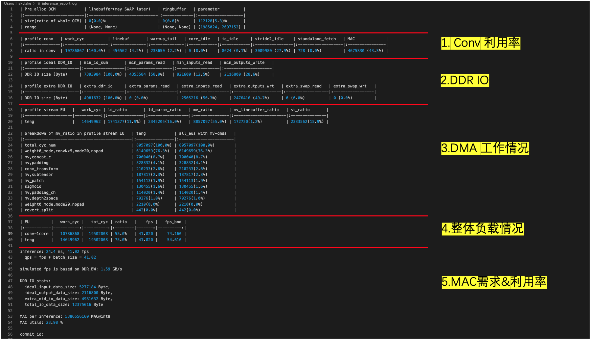
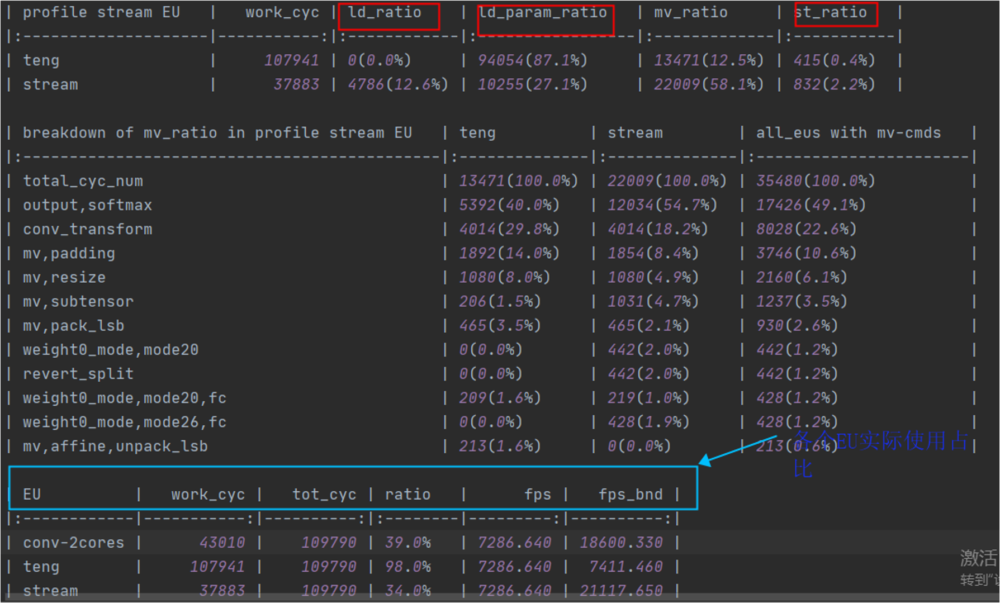

=========================
FAQ 
=========================

-------------------------
基本问题
-------------------------

.. data:: 如果遇到长时间无法解决的问题

  如果遇到长时间无法解决的问题, 请联系相关 ``FAE`` 同学支持. 同时也需要注意, 尽量使用 **最新版本** 的工具链进行模型转换.

.. data:: joint 模型基本信息

    ``joint`` 模型基本信息:
      - 模型输入 ``tensor`` 的 ``DType`` 默认为 ``UINT8``, ``Layout`` 为 ``NHWC``.
      - 模型输出 ``tensor`` 的 ``DType`` 默认为 ``FLOAT32``, ``Layout`` 为 ``NCHW``.
      - ``ColorSpace``: 默认为 ``TENSOR_COLOR_SPACE_AUTO``, 可以根据模型输入 ``channel`` 数自动识别
          - 3-channel: ``BGR``
          - 1-channel: ``GRAY``
          - 其他可选: ``RGB``, ``NV12``, ``NV21``, ``BGR0``

.. data:: 如果需要换 VNPU 设定, 需要重新编译, 而不能通过已有的 joint 直接更换 VNPU 设定

  想要做到直接通过 ``joint`` 模型来修改 ``vnpu`` 设定在技术上无法实现, 原因在于:
  
  1. 工具链在编译时需要根据输入的配置信息进行模型编译, 而编译是把最初的模型逐步变成二进制指令代码, 需要模型的很多原始信息
  
  2. 编译又是不断 ``lowering`` 的过程, 会丢失信息, 编译后的二进制指令代码, 无法复原出最开始的模型信息
  
  3. 除此之外, 不同 ``vnpu`` 配置下会使用不同的硬件资源, 编译出的最优二进制模型不同
  
  综上, 如果需要修改 ``vnpu`` 的模式, 需要重新进行转换.

.. data:: 检测模型在转换过程中出现 OutOfMemory(OOM) 错误, 如何解决

  检测模型如果输出 ``layout`` 为 ``NCHW`` 的话,  会出现 ``OOM`` 错误, 这是
  因为 ``NPU`` 默认输出 ``layout`` 为 ``NHWC``, 而检测模型输出的 ``featuremap`` 较大, 
  直接 ``transpose`` 时容易挤爆内存. 因此检测模型转换时需要指定输出 ``layout``:

  .. code-block:: bash

    pulsar build --input xxx.onnx --config xxx.prototxt --output xxx.joint --output_tensor_layout nhwc

.. data:: 如何查看 NPU 利用率

  ``ssh`` 登录开发板后, 使用以下代码查看:

  .. code-block:: bash

    $ cd /proc/ax_npu
    $ echo 1 > enable
    # Echo 1 >/proc/ax_proc/ax_npu/enable
    $ cat top_period_ms

.. data:: pulsar build 的 --config 和 --output_config 有什么区别

  ``--config`` 是用户友好的 ``prototxt`` , 提供了多种简化配置的语法糖

  ``--output_config`` 会展开所有语法糖, 并保存成工具链友好的配置文件
  
  现阶段 ``pulsar run`` 仿真功能需要使用 ``--output_config`` 生成的配置文件

.. data:: pulsar build 中输出的仿真 fps 与上板实测 fps 差距较大

  需要针对模型具体分析, 一般差异原因有以下两点
  
    - ``neu fps`` 较大是由于板上 ``DDR`` 不受限, 而 ``pulsar`` 仿真严格卡了 ``DDR`` 带宽
    - ``neu fps`` 较小是由于 ``Pulsar`` 仿真的 ``Cycle Model`` 中, 之前省去的小量(比如 ``LUT`` 配置时间), 在某些 ``case`` 下变得不可忽略

.. data:: 如何在 Prototxt 中配置多 Batch

  通过以下配置可以自主设置目标 ``batch_size`` 值.

  .. code-block:: bash

    # 配置文件参数路径: pulsar_conf
    pulsar_conf {
      batch_size: 2  # 编译模型推理时的 batch size 设置为 2
    }

.. data:: 如何在 Prototxt 中配置动态 Batch

  通过以下配置可以实现动态 ``Batch``.

  .. code-block:: bash

    # 配置文件参数路径: pulsar_conf
    pulsar_conf {
      batch_size_option: BSO_DYNAMIC # 编译后的模型支持动态 batch
      batch_size: 1                  # 实际推理时常用 batch_size
      batch_size: 2                  # 实际推理时常用 batch_size
      batch_size: 4                  # 最大 batch_size 为 4
    }

  更详细的介绍可以参考 :ref:`pulsar_conf <pulsar_conf>`.

.. data:: onnx 模型输入是 RGB, 期望转出来的 joint 模型也是 RGB 输入, 应该如何操作

  在配置文件中配置如下: 

  .. code-block:: bash

    dst_input_tensors {
      color_space: TENSOR_COLOR_SPACE_RGB
    }

.. data:: 转出来的 .joint 模型可以像之前 .neu 模型上板跑么

  ``.joint`` 可以像 ``.neu`` 一样上板跑. 事实上 ``.joint`` 模型是当前主流上板模型格式 ``.neu`` 模型是旧版格式, ``Pulsar`` 可以将 ``.neu`` 模型转换成 ``.joint`` 模型

.. data:: PTQ 能跑 GPU 吗

  工具链本身是支持的, 但 ``docker`` 本身出于大小考虑没用 ``nvidia`` 基础镜像

.. data:: dataset_output_type 默认是 BGR, 是否指使用数据集里的图片校正时使用的是 BGR 格式输入到模型. 如果是的话 config.prototxt 里的 mean 和 std 是不是也要按照 BGR 顺序设置

  是需要按照顺序配置的. ``dataset_output_type`` 值是 ``BGR`` 代表编译时是按照 ``BGR`` 格式来读取的校正图片数据, 从而 ``mean/std`` 也要按 BGR 顺序设置

.. data::  如何在 config.prototxt 中配置 Q 值

  可以通过以下配置完成.

  .. code-block:: bash

    dst_output_tensors {
      data_type: INT16
    }

.. data:: Q 值是 int16 吗

  ``Q`` 值不完全是 ``int16``. ``Q`` 值类型可配, 详见 :ref:`data_type类型 <data_type>`

.. data:: Q 值的 CPU 子图时间怎么算

  ``Q`` 值没有 ``CPU`` 子图, 但遗留了 ``/Q`` 的算术操作到客户的后处理代码

.. data:: Q 值不还是要接 CPU 做除法, 没有省时间啊

  是要接 ``CPU`` , 但 ``/Q`` 操作可以跟其他操作耦合起来, 大部分情况都是几乎免费的

  比如检测后处理步骤 ``NMS`` 后需要做除法, 则 ``分母*Q`` 即可

  检测网络单独做大 ``tensor`` 乘法, 可能需要 ``NPU`` 数倍时间,  ``NMS`` 后计算量小

.. data:: 转出模型的 Q 值接口是什么

  直接 **上板执行** ``run_joint model.joint``, 在日志会有打印

  ``joint sdk`` 中 ``C++`` 接口也有 ``nQuantizationValue``

.. data:: 工具链和硬件支持稀疏化加速吗

  支持结构化稀疏和低位宽, 非结构化稀疏没有硬件支持.

------------------------------
查看 Inference Report 报表
------------------------------

根据 ``inference_report`` 能够:

  - 分析推理的瓶颈: ``CONV``, ``DDR``, ``DMA``, ``算子``
  - 统计算力损耗的来源
  - 评估继续优化的空间
  - 分析速度的优化方向

在 ``pulsar build`` 命令运行完成后会在当前工作目录下保存一个 ``inference_report`` 文件夹,

  - 该文件夹下包含一个或多个 ``part_x.lava`` 文件夹(其中 ``x`` 代表编号, 从 ``0`` 开始),
  - 每一个 ``part_x.lava`` 文件夹下均包含一个 ``inference_report.log`` 文件,
  - 对于小模型来讲通常只有一个 ``part_0.lava`` 文件夹以及一个 ``inference_report.log``, 
  - 而当模型过大时, 会拆成多个子模型按顺序执行, 这样就会出现多个 ``part_0.lava`` 文件夹.

这种情况下, 这个模型的 ``tot_cyc`` 是这些单个子模型的 ``tot_cyc`` 之和, 与 ``DDR`` 
交互传输的数据量 ``total_io_data_size`` 是这些单个子模型的 ``total_io_data_size`` 之和.

.. code-block:: sh

  # 模型较小, 仅包含 part_0.lava 文件夹
  ➜  DEMO cd inference_report
  ➜  inference_report tree -L 2
  .
  └── part_0.lava
      ├── inference_report.log
      ├── subgraph_0
      ├── subgraph_1
      ├── subgraph_2
      ├── subgraph_3
      ├── subgraph_4
      └── subgraph_5

  7 directories, 1 file

查看 ``inference_report.log`` , 示例如下:

``inference_report.log`` 中包含一些自定义术语, 以下对部分术语进行 **名词解释**

- ``ld``, 即从 ``DDR`` 读, 往 ``OCM`` 写
- ``st``, 从 ``OCM`` 读, 往 ``DDR`` 写
- ``mv``, 从 ``OCM`` 读, 往 ``OCM`` 写

通过一个典型的示例说明 ``inference_report.log`` 的作用, 如以下 ``case``:

在非虚拟 ``NPU`` 条件下, 如图(上图蓝框)所示, 有三类 ``EU`` 参与了模型推理, 分别为 ``conv-2cores``、 ``teng`` 以及 ``stream``, 
而表格统计了 ``cycle`` 占比, 物理意义为每类 ``EU`` 实际运行的 ``cycle`` 除以模型推理实际花费的总 ``cycle``. 该 ``ratio`` 可直观反应 ``EU`` 的繁忙程度, 
例如图中 ``teng`` 的 ``ratio`` 达到了 ``98%``, 几乎已经在满负荷工作.

``teng`` 和 ``stream`` 具备在 ``DDR`` 上进行数据读写的能力. 在图的 ``profile stream EU`` 中详细统计了各类任务所占的比重, 
可观察 ``ld_ratio/ld_param_ratio/st_ratio`` (上图红框) 的数值, 反应了对应 ``EU`` 进行 ``DDR`` 读写任务的时间及占比, 进而可分析 ``DDR`` 带宽压力.

**总结**

一般而言, 下述条件可以反应模型在给定 ``DDR_BW`` 情况下的速度瓶颈:

  - ``teng/stream`` 的 ``ratio`` 占比较高, 且明显高于其他 ``EU`` 的 ``ratio``
  - ``teng/stream`` 中的 ``ld_ratio/ld_param_ratio/st_ratio`` 占比较高

反之, 下述条件可以反应模型的速度瓶颈为计算能力:

  - ``conv`` 的 ``ratio`` 占比较高, 且明显高于其他 ``EU`` 的 ``ratio``

更具体点说, 图中模型 ``teng`` 的 ``ratio`` 为 ``98%``, 显著高于 ``conv`` 的 ``39.0%``; 
而 ``teng`` 中的 ``DDR`` 读写任务的时间占比为 ``87.1% + 0.4% = 87.5%``, 占了该 ``EU`` 的主要工作时间, 因此认为该模型的速度瓶颈为 ``DDR`` 带宽。

.. hint::

  对于虚拟 ``NPU111`` 来讲, 其中只有两个 ``EU``, 分别为 ``conv-1core/teng``, 统计方式与非虚拟 ``NPU`` 一样.