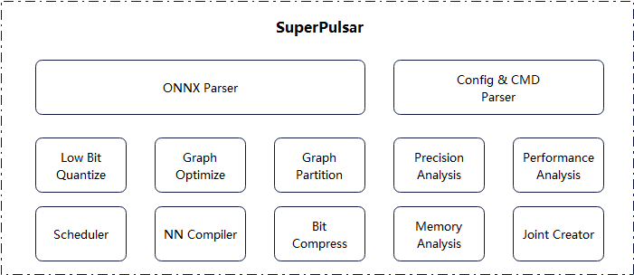
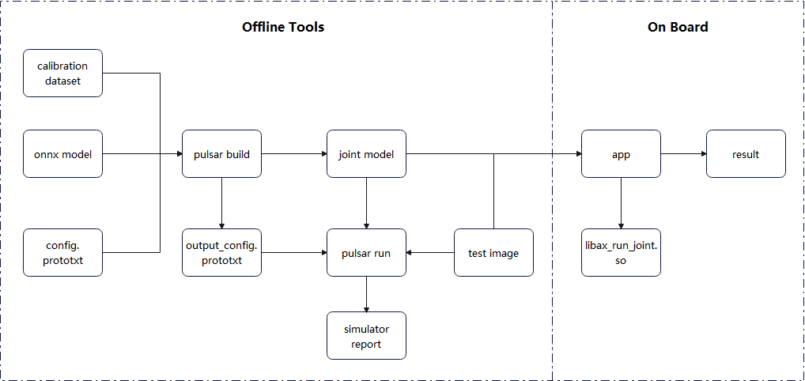

========================================
Pulsar工具链概述
========================================

----------------------------
简介
----------------------------

**Pulsar** 由 `爱芯元智 <https://www.axera-tech.com/>`_ **自主研发** 的 ``all-in-one`` 神经网络编译器, 
即 **转换**、 **量化**、 **编译**、 **异构** 四合一, 实现深度学习神经网络模型 **快速**、 **高效** 的部署需求. 
针对 `AX6` 系列芯片特性进行了深度定制优化, 充分发挥片上异构计算单元(CPU+NPU)算力, 提升神经网络模型的产品部署效率.

``Pulsar`` 工具链核心功能是将 ``.onnx`` 模型编译成芯片能解析并运行的 ``.joint`` 模型.

**架构图**

**部署流程**

.. _soc_introduction:

----------------------------
虚拟 NPU 介绍
----------------------------

``AXera`` 目前提供 ``AX630A`` 、 ``AX620A`` 、``AX620U`` 三款可用芯片, 以下对这几款芯片的虚拟 NPU 硬件配置信息作简要描述.

~~~~~~~~~~~~~~~~~~~~~~~~~~~~
AX630A
~~~~~~~~~~~~~~~~~~~~~~~~~~~~

**虚拟 NPU (Neural-network Processing Unit)**

+-------+----------+
|  模式 |  支持列表|
+=======+==========+
|DEFAULT|0         |
+-------+----------+
|2_2    |221、222  |
+-------+----------+
|3_1    |311、312  |
+-------+----------+

.. note::

    | ``NPU`` 硬件初始化只能选择一种模式
    | ``DEFAULT`` 模式: 不划分 ``NPU`` 资源, 使用全部 ``NPU`` 资源
    | ``2_2`` 模式: 对半划分 ``NPU`` 资源, ``221`` 和 ``222`` 各使用一半的 ``NPU`` 资源
    | ``3_1`` 模式: 不对等的划分 NPU 资源, ``311`` 模式下的资源大概为 ``312`` 的3倍
    | 通过虚拟 ``NPU`` 模式, 可以同时跑 ``PTQ`` 和 ``AI-ISP`` 模型

~~~~~~~~~~~~~~~~~~~~~~~~~~~~
AX620A
~~~~~~~~~~~~~~~~~~~~~~~~~~~~

**虚拟 NPU**

+---------+----------+
|   模式  | 支持列表 |
+=========+==========+
| DEFAULT | 0        |
+---------+----------+
| 1_1     | 111、112 |
+---------+----------+

.. note::

    | ``NPU`` 硬件初始化只能选择一种模式
    | ``DEFAULT`` 模式: 不划分 ``NPU`` 资源, 使用全部 ``NPU`` 资源
    | ``1_1`` 模式: 对半划分 ``NPU`` 资源, ``111`` 和 ``112`` 各使用一半的 ``NPU`` 资源
    | 通过虚拟 ``NPU`` 模式, 可以同时跑 ``PTQ`` 和 ``AI-ISP`` 模型

~~~~~~~~~~~~~~~~~~~~~~~~~~~~
AX620U
~~~~~~~~~~~~~~~~~~~~~~~~~~~~

``AX620U`` 与 ``AX620A`` 在上述功能上相同。
