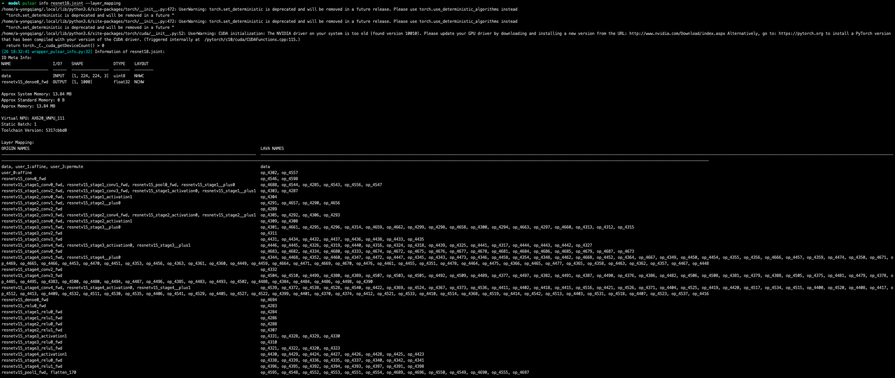
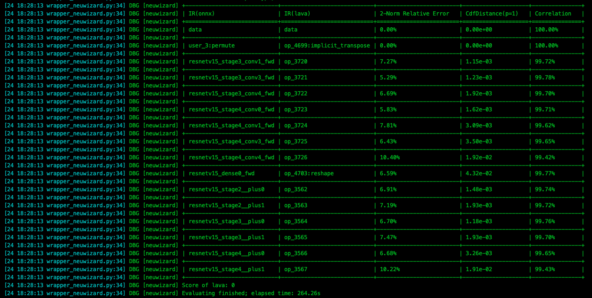
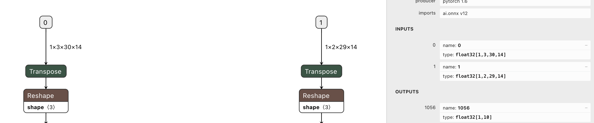

===================
模型转换进阶指南
===================

-----------------------
Pulsar Build 模型编译
-----------------------

本节介绍 ``pulsar build`` 命令完整使用方法. 

~~~~~~~~~~~~~~~~
概述
~~~~~~~~~~~~~~~~

``pulsar build`` 用于模型优化、量化、编译等操作. 其运行示意图如下: 

.. mermaid::

  graph LR;
  输入模型[输入模型 onnx] --> pb(pulsar build +命令行参数)
  配置文件[配置文件 config.prototxt] --> pb
  pb --> 输出模型[输出模型 joint]
  pb --> 输出配置文件[配置文件 output_config.prototxt]

``pulsar build`` 利用输入模型(``model.onnx``)和配置文件(``config.prototxt``), 编译得到输出模型(``joint``)和输出配置文件(``output_config.prototxt``). 

``pulsar build`` 的命令行参数将会覆盖配置文件中的某些对应部分, 并使 ``pulsar build`` 将覆盖过后得到的配置文件输出出来. 配置文件的详细介绍参见 :ref:`配置文件详细说明 <config_details>`. 

``pulsar build -h`` 可显示详细命令行参数: 

.. code-block:: python
  :name: pulsar_build_help
  :linenos:

  root@xxx:/data# pulsar build -h
  usage: pulsar build [-h] [--config CONFIG] [--output_config OUTPUT_CONFIG]
                      [--input INPUT [INPUT ...]] [--output OUTPUT [OUTPUT ...]]
                      [--calibration_batch_size CALIBRATION_BATCH_SIZE]
                      [--compile_batch_size COMPILE_BATCH_SIZE [COMPILE_BATCH_SIZE ...]]
                      [--batch_size_option {BSO_AUTO,BSO_STATIC,BSO_DYNAMIC}]
                      [--output_dir OUTPUT_DIR]
                      [--virtual_npu {0,311,312,221,222,111,112}]
                      [--input_tensor_color {auto,rgb,bgr,gray,nv12,nv21}]
                      [--output_tensor_color {auto,rgb,bgr,gray,nv12,nv21}]
                      [--output_tensor_layout {native,nchw,nhwc}]
                      [--color_std {studio,full}]
                      [--target_hardware {AX630,AX620,AX170}]
                      [--enable_progress_bar]

  optional arguments:
    -h, --help            show this help msesage and exit
    --config CONFIG       .prototxt
    --output_config OUTPUT_CONFIG
    --input INPUT [INPUT ...]
    --output OUTPUT [OUTPUT ...]
    --calibration_batch_size CALIBRATION_BATCH_SIZE
    --compile_batch_size COMPILE_BATCH_SIZE [COMPILE_BATCH_SIZE ...]
    --batch_size_option {BSO_AUTO,BSO_STATIC,BSO_DYNAMIC}
    --output_dir OUTPUT_DIR
    --virtual_npu {0,311,312,221,222,111,112}
    --input_tensor_color {auto,rgb,bgr,gray,nv12,nv21}
    --output_tensor_color {auto,rgb,bgr,gray,nv12,nv21}
    --output_tensor_layout {native,nchw,nhwc}
    --color_std {studio,full}
                          only support nv12/nv21 now
    --target_hardware {AX630,AX620,AX170}
                          target hardware to compile
    --enable_progress_bar

.. hint::

  利用配置文件可以实现复杂功能, 而命令行参数只是起一个辅助作用. 另外, 命令行参数会 override 配置文件中的某些对应配置.

~~~~~~~~~~~~~~~~
参数详解
~~~~~~~~~~~~~~~~

.. data:: pulsar build 参数解释

  --input
    
    本次编译的输入模型路径, 对应 ``config.prototxt`` 中的 :ref:`input_path字段 <input_path>`

  --output
  
    指定输出模型的文件名, 如 ``compiled.joint``, 对应 ``config.prototxt`` 中的 :ref:`output_path字段 <output_path>`

  --config
  
    指定用于指导本次编译过程所用的基本配置文件. 如果为 ``pulsar build`` 命令指定了命令行参数, 则转换模型过程中优先使用命令行参数中指定的值

  --output_config
  
    将本次编译过程所使用的完整配置信息输出到文件

  --target_hardware
  
    指定编译输出模型所适用的硬件平台, 目前有 ``AX630`` 和 ``AX620`` 可选

  --virtual_npu
  
    指定推理时使用的虚拟 NPU , 请根据 ``--target_hardware`` 参数进行区别. 详情参见 :ref:`芯片介绍 <soc_introduction>` 中的虚拟NPU部分

  --output_dir
  
    指定编译过程的工作目录. 默认为当前目录

  --calibration_batch_size
  
    转模型过程中, 内部参数校准时所使用数据的 ``batch_size``. 默认值为 ``32``

  --batch_size_option
    
    设置 ``joint`` 格式模型所支持的 ``batch`` 类型:

      - ``BSO_AUTO``: 默认选项, 默认为静态 ``batch``
      - ``BSO_STATIC``: 静态 ``batch``, 推理时固定 ``batch_size``, 性能最优
      - ``BSO_DYNAMIC``: 动态 ``batch``, 推理时支持不超过最大值的任意 ``batch_size``, 使用最灵活

  --compile_batch_size
  
    设置 ``joint`` 格式模型所支持的 ``batch size``. 默认为 ``1``

      - 当指定了 ``--batch_size_option BSO_STATIC`` 时, ``batch_size`` 表示 ``joint`` 格式模型推理时能用的唯一 ``batch size``
      - 当指定了 ``--batch_size_option BSO_DYNAMIC`` 时, ``batch_size`` 表示 ``joint`` 格式模型推理时所能使用的最大 ``batch size``

  --input_tensor_color

    指定 **输入模型** 的 **输入数据** 的色彩空间, 可选项:

      - 默认选项: ``auto``, 根据模型输入 channel 数自动识别
          * 3-channel 为 ``bgr``
          * 1-channel 为 ``gray``
      - 其他可选项: ``rgb``, ``bgr``, ``gray``, ``nv12``, ``nv21``

  --output_tensor_color

    指定 **输出模型** 的 **输入数据** 的色彩空间, 可选项:

      - 默认选项: ``auto``, 根据模型输入 channel 数自动识别
          * 3-channel 为 ``bgr``
          * 1-channel 为 ``gray``
      - 其他可选项: ``rgb``, ``bgr``, ``gray``, ``nv12``, ``nv21``

  --color_std

    指定用于在 ``RGB`` 和 ``YUV`` 之间转换时所采用的转换标准, 可选项: ``legacy``, ``studio`` 和 ``full``, 默认值为 ``legacy``

  --enable_progress_bar

    编译时显示进度条. 默认不显示
  
  --output_tensor_layout

    指定 **输出** 模型的 **输出** ``tensor`` 的 ``layout``, 可选:

      - ``native``: 默认选项, 历史遗留选项, 不推荐使用. 建议显式指定输出 ``layout``
      - ``nchw``
      - ``nhwc``
    
    .. attention::
    
      ``axera_neuwizard_v0.6.0.1`` 及以后版本的工具链才支持此参数. 
      从 ``axera_neuwizard_v0.6.0.1`` 开始,  部分 ``AX620A`` 模型的输出 ``tensor`` 的默认 ``layout`` 
      可能与 ``axera_neuwizard_v0.6.0.1`` 之前版本的工具链编译出来的模型不同. ``AX630A`` 模型的默认 ``layout`` 不受工具链版本的影响

代码示例

.. code-block::
  :linenos:

  pulsar build --input model.onnx --output compiled.joint --config my_config.prototxt --target_hardware AX620 --virtual_npu 111 --output_config my_output_config.prototxt

.. tip::

  当生成支持动态 ``batch`` 的 ``joint`` 模型时, 可以在 ``--compile_batch_size`` 后面指定多个常用的 ``batch_size``, 以提高使用不超过这些值的 ``batch size`` 进行推理时的性能. 
  
.. attention::

  指定多个 ``batch size`` 会增加 ``joint`` 模型文件的大小.

.. _pulsar_run:

-------------------------------
Pulsar Run 模型仿真与对分
-------------------------------

本节介绍 ``pulsar run`` 命令完整使用方法.

~~~~~~~~~~~~~~~~~
概述
~~~~~~~~~~~~~~~~~

``pulsar run`` 用于在 ``x86`` 平台上对 ``joint`` 模型进行 **x86仿真** 和 **精度对分**.

.. mermaid::

  graph LR;
  目标模型[目标模型 joint] --> pulsar_run(pulsar run +命令行参数)
  参考模型[参考模型 onnx] --> pulsar_run
  图像文件[图像文件 jpg / png] --> pulsar_run
  pulsar_run --> 对分结果
  pulsar_run --> gt[目标模型的仿真 inference 结果 + 上板输入数据]

``pulsar run -h`` 可显示详细命令行参数:

.. code-block:: python
  :name: input_conf_items
  :linenos:

  root@xxx:/data# pulsar run -h
  usage: pulsar run [-h] [--use_onnx_ir] [--input INPUT [INPUT ...]]
                    [--layer LAYER [LAYER ...]] [--output_gt OUTPUT_GT]
                    [--config CONFIG]
                    model [model ...]

  positional arguments:
    model

  optional arguments:
    -h, --help                   show this help msesage and exit
    --use_onnx_ir                use NeuWizard IR for refernece onnx
    --input INPUT [INPUT ...]    input paths or .json
    --layer LAYER [LAYER ...]    input layer namse
    --output_gt OUTPUT_GT        save gt data in dir
    --config CONFIG

.. data:: pulsar run 参数解释

  **必要参数**
  
    ``model.joint`` ``model.onnx``

  --input

    可以指定多个输入数据, 并作为仿真 ``inference`` 的输入数据. 支持 ``jpg``、 ``png``、 ``bin`` 等格式, 需要保证其个数与模型输入层个数一致
  
  --layer

    | 不是必需项
    | 当模型有多路输入时, 用于指定输入数据对应哪一层. 其顺序与 ``--input`` 呈对照关系
    | 比如 ``--input file1.bin file2.bin --layer layerA layerB`` 就代表给 ``layerA`` 输入 ``file1.bin``、给 ``layerB`` 输入 ``file2.bin``, 需要保证 ``--layer`` 的长度与 ``--input`` 的长度一致
  
  --use_onnx_ir

    | 当使用 ``onnx`` 格式模型作为对分参考模型时, 此选项用以告诉 ``pulsar run`` 在内部用 ``NeuWizard IR`` 推理 ``onnx`` 模型. 默认不使用 ``NeuWizard IR``
    | 此选项只有在指定了 ``--onnx`` 时才有意义, 该选项可忽略

  --output_gt

    指定用于存放目标模型的仿真 ``inference`` 结果和上板输入数据的目录. 默认不输出

  --config
  
    指定配置文件, 用于指导 ``pulsar run`` 在内部转换参考模型. 一般使用 ``pulsar build`` 的 ``--output_config`` 选项输出的配置文件

``pulsar run`` 代码示例

.. code-block:: python

  pulsar run model.onnx compiled.joint --input test.jpg --config my_output_config.prototxt --output_gt gt

---------------------------
Pulsar Info 查看模型信息
---------------------------

.. Attention::

  注意: 只有在版本号大于 ``0.6.1.2`` 的 ``docker`` 工具链中才能正常使用 ``pulsar info`` 功能.

  对于旧版本工具链转出的 ``.joint`` 模型, 无法通过 ``pulsar info`` 查看正确的信息, 需要利用新版本工具链重新转换. 原因在于旧版本 ``joint`` 中的 ``Performance.txt`` 文件不包含 ``onnx layer name`` 信息, 需要重新转换生成.

``pulsar info`` 用于查看 ``onnx`` 和 ``joint`` 模型的信息, 并支持将模型信息保存为 ``html``, ``grid``, ``jira`` 等格式.

**用法命令**

.. code-block:: bash

  pulsar info model.onnx/model.joint

**参数列表**

.. code-block:: bash

  $ pulsar info -h

  usage: pulsar info [-h] [--output OUTPUT] [--output_json OUTPUT_JSON]
                    [--layer_mapping] [--performance] [--part_info]
                    [--tablefmt TABLEFMT]
                    model

  positional arguments:
    model

  optional arguments:
    -h, --help            show this help msesage and exit
    --output OUTPUT       path to output dir
    --output_json OUTPUT_JSON
    --layer_mapping
    --performance
    --part_info
    --tablefmt TABLEFMT   possible formats (html, grid, jira, etc.)

**参数说明**

.. data:: pulsar info 参数解释

  --output

    指定模型信息保存目录, 默认不保存

  --output_json

    以 Json 形式保存模型的完整信息, 默认不保存

  --layer_mapping

    显示 Joint 模型的 layer_mapping 信息, 默认不显示
    
    可以用于查看 onnx layer 与转换后的 lava layer 间的对应关系

  --performance

    显示 Joint 模型的 performance 信息, 默认不显示

  --part

    显示 Joint 模型每个部分的全部信息, 默认不显示

  --tablefmt

    指定模型信息显示和保存格式, 可选项:
      * simple: 默认选择项
      * grid
      * html
      * jira
      * ... 任意 tabulate 库支持的 tablefmt 格式

**示例: 查看模型基本信息**

.. code-block:: bash

  pulsar info resnet18.joint

  # output log
  [24 18:40:10 wrapper_pulsar_info.py:32] Information of resnet18.joint:
  IO Meta Info:
  NAME                  I/O?    SHAPE             DTYPE    LAYOUT
  --------------------  ------  ----------------  -------  --------
  data                  INPUT   [1, 224, 224, 3]  uint8    NHWC
  resnetv15_dense0_fwd  OUTPUT  [1, 1000]         float32  NCHW

  Approx System Memory: 13.84 MB
  Approx Standard Memory: 0 B
  Approx Memory: 13.84 MB

  Virtual NPU: AX620_VNPU_111
  Static Batch: 1
  Toolchain Version: dfdce086b

**示例: 查看 onnx layer 与编译后模型的 layer 之间的对应关系**

其中 ``ORIGIN_NAmse`` 为原 ``onnx`` 的 ``layer name``, 而 ``LAVA_NAmse`` 则为编译后模型的 ``layer name``.

.. note::

  在 ``pulsar info`` 中指定参数:

  - ``--layer_mapping`` 参数可查看 ``onnx_layer_name`` 与转换后模型 ``layer_name`` 之间的对应关系
  - ``--performance`` 参数可以查看各个 ``layer`` 的 ``performance`` 信息

------------------------------------
Pulsar Version 查看工具链版本
------------------------------------

``pulsar version`` 用于获取工具的版本信息.

.. hint::

  如果需要向我们提供工具链的错误信息, 请将您所使用的工具链版本信息一并提交给我们.

代码示例

.. code-block:: bash

  pulsar version

示例结果

.. code-block:: bash

  0.5.34.2
  7ca3b9d5

----------------
配套工具
----------------

``SuperPulsar`` 工具链还提供了其他常用的网络模型处理工具, 有助于使用者对网络模型进行格式转换等功能.

~~~~~~~~~~~~~~~~~~
Caffe2ONNX
~~~~~~~~~~~~~~~~~~

在 ``SuperPulsar`` 的 ``Docker`` 镜像中预装了 ``dump_onnx.sh`` 工具, 提供将 ``Caffe`` 模型转换成 ``ONNX`` 模型的功能, 从而间接拓展了 ``pulsar build`` 对 ``Caffe`` 模型的支持. 具体使用方法如下所示: 

``dump_onnx.sh -h`` 可显示详细命令行参数: 

.. code-block:: bash
  :name: dump_onnx_sh
  :linenos:

  root@xxx:/data$ dump_onnx.sh
  Usage: /root/caffe2onnx/dump_onnx.sh [prototxt] [caffemodel] [onnxfile]

选项解释

- **[prototxt]**

  输入的 ``caffe`` 模型的 ``*.prototxt`` 文件路径
  
- **[caffemodel]**

  输入的 ``caffe`` 模型的 ``*.caffemodel`` 文件路径

- **[onnxfile]**

  输出的 ``*.onnx`` 模型文件路径

代码示例

.. code-block:: shell
  :name: dump_onnx_demo
  :linenos:

  root@xxx:/data$ dump_onnx.sh model/mobilenet.prototxt model/mobilenet.caffemodel model/mobilenet.onnx

log 信息示例如下

.. code-block:: bash
  :name: dump_onnx_log
  :linenos:

  root@xxx:/data$ dump_onnx.sh model/mobilenet.prototxt model/mobilenet.caffemodel model/mobilenet.onnx
  2. start model conversion
  =================================================================
  Converting layer: conv1 | Convolution
  Input:  ['data']
  Output:  ['conv1']
  =================================================================
  Converting layer: conv1/bn | BatchNorm
  Input:  ['conv1']
  Output:  ['conv1']
  =================================================================
  Converting layer: conv1/scale | Scale
  Input:  ['conv1']
  Output:  ['conv1']
  =================================================================
  Converting layer: relu1 | ReLU
  Input:  ['conv1']
  Output:  ['conv1']
  =================================================================
  ####省略若干行 ############
  =================================================================
  Node:  prob
  OP Type:  Softmax
  Input:  ['fc7']
  Output:  ['prob']
  ====================================================================
  2. onnx model conversion done
  4. save onnx model
  model saved as: model/mobilenet.onnx

~~~~~~~~~~~~~~~~~~~~~~~~~~~~~~~~
parse_nw_model
~~~~~~~~~~~~~~~~~~~~~~~~~~~~~~~~

**功能**

统计 ``joint`` 模型 ``cmm`` 使用情况

.. code-block:: sh
  :linenos:

  usage: parse_nw_model.py [-h] [--model MODEL]

  optional arguments:
    -h, --help     show this help msesage and exit
    --model MODEL  dot_neu or joint file

**使用方法示例**

以下命令只适用于工具链 ``docker`` 环境

.. code-block:: sh
  :linenos:

  python3 /root/python_modules/super_pulsar/super_pulsar/tools/parse_nw_model.py --model yolox_l.joint
  python3 /root/python_modules/super_pulsar/super_pulsar/tools/parse_nw_model.py --model part_0.neu

**返回结果示例**

.. code-block:: sh
  :linenos:

  {'McodeSize': 90816, 'WeightsNum': 1, 'WeightsSize': 568320, 'ringbuffer_size': 0, 'input_num': 1, 'input_size': 24576, 'output_num': 16, 'output_size': 576}

**字段说明**

.. list-table::
    :widths: 10 60
    :header-rows: 1

    * - 字段
      - 说明
    * - 单位
      - Byte
    * - McodeSize
      - 二进制代码 Size
    * - WeightsNum
      - 表示权重个数
    * - WeightsSize
      - 权重 Size
    * - ringbuffer_size
      - 表示模型运行期间需要申请的 DDR Swap 空间
    * - input_num
      - 表示模型的输入 Tensor 数
    * - input_size
      - 输入 Tensor Size
    * - output_num
      - 输出 Tensor 数
    * - output_size
      - 输出 Tensor Size

.. hint::
  
  该脚本统计 ``joint`` 模型中所有 ``.neu`` 的 ``CMM`` 内存, 返回结果为所有 ``.neu`` 文件的解析结果之和.

~~~~~~~~~~~~~~~~~~~~~~~~~~~~~~~~
``Joint`` 模型初始化速度补丁工具
~~~~~~~~~~~~~~~~~~~~~~~~~~~~~~~~

**概述**

.. hint::

  对于 ``neuwizard-0.5.29.9`` 及更早版本工具链转换的 ``Joint`` 模型文件, 
  可以使用 ``optimize_joint_init_time.py`` 工具离线刷新, 以减少 ``Joint`` 模型加载时间, 推理结果和时间不变.

**使用方法**

.. code-block:: bash

  cd /root/python_modules/super_pulsar/super_pulsar/tools
  python3 optimize_joint_init_time.py --input old.joint --output new.joint

~~~~~~~~~~~~~~~~~~~~~~~~~~~~~~~~~~~~~~~~~~~~~~~~~~~~~~~~~~~~~~~~~~~~~~~~
将 ``Joint`` 模型中的 ``ONNX`` 子图转为 ``AXEngine`` 子图
~~~~~~~~~~~~~~~~~~~~~~~~~~~~~~~~~~~~~~~~~~~~~~~~~~~~~~~~~~~~~~~~~~~~~~~~

**使用方法**

.. hint::

  如下一条指令即可将名为 ``input.joint`` 的 ``Joint`` 模型(以 ``ONNX`` 作为 ``CPU`` 后端实现)转为 ``Joint`` 模型(以 ``AXEngine`` 作为 ``CPU`` 后端实现), 并且开启优化模式.

.. code-block:: python

  python3 /root/python_modules/super_pulsar/super_pulsar/tools/joint_onnx_to_axe.py --input input.joint --output output.joint --optimize_slim_model

**参数释义**

.. data:: 参数释义

  --input

    转换工具的输入 ``Joint`` 模型路径
  
  --output

    转换工具的输出 ``Joint`` 模型路径
  
  --optimize_slim_model

    开启优化模式. 当网络输出特征图较小时建议开启, 否则不建议

~~~~~~~~~~~~~~~~~~~~~~~~~~~~~~~
``wbt_tool`` 使用说明
~~~~~~~~~~~~~~~~~~~~~~~~~~~~~~~

**背景**

- 某些模型在不同使用场景下需要不同的网络权重, 例如 VD 模型的使用场景分为白天和夜晚, 两个网络结构一样, 但权重不一样, 是否可以设置成不同场景使用不同的权重, 即同一个模型保存多组权重信息 
- 可以通过 ``SuperPulsar`` 工具链 ``Docker`` 中提供的 ``wbt_tool`` 脚本可以实现一个模型, 多套参数的需求

**工具概述**

工具路径: ``/root/python_modules/super_pulsar/super_pulsar/tools/wbt_tool.py``, 注意需要给 ``wbt_tool.py`` 可执行权限

.. code-block:: bash

  # 添加可执行权限
  chmod a+x /root/python_modules/super_pulsar/super_pulsar/tools/wbt_tool.py

.. data:: wbt_tool 功能参数

  info
    查看操作, 可以查看 ``Joint`` 模型的 ``wbt`` 名称信息, 如果是 ``None``, 在 ``fuse`` 时需要手动指定

  fuse
    合并操作, 将多个网络结构一样, 网络权重不同的 ``Joint`` 模型, 合成一个具有多份权重的 ``Joint`` 模型

  split
    拆分操作, 将一个具有多份权重的 ``Joint`` 模型, 拆分成多个网络结构一样, 网络权重不同的 ``Joint`` 模型

**使用限制**

.. warning::

  不支持含多份 ``wbt`` 的 ``Joint`` 模型之间的合并, 
  有需求时请先拆分成多个含单份 ``wbt`` 的 ``Joint`` 模型, 再和其他模型合并.

**示例1**

查看模型 ``model.joint`` 的 ``wbt`` 信息:

.. code-block:: python

  <wbt_tool> info model.joint

  part_0.neu's wbt_namse:
      index 0: wbt_#0
      index 1: wbt_#1

.. hint::

  其中 ``<wbt_tool>`` 为 ``/root/python_modules/super_pulsar/super_pulsar/tools/wbt_tool.py``

**示例2**

合并名为 ``model1.joint``, ``model2.joint`` 的两个模型至名为 ``model.joint`` 的模型, 使用 ``Joint`` 模型中自带的 ``wbt_name``

.. code-block:: python

  <wbt_tool> fuse --input model1.joint model2.joint --output model.joint

.. attention::

    如果 ``wbt_tool info`` 查看到 ``joint`` 模型的 ``wbt_name`` 为 ``None``, 需要手动指定 ``wbt_name``, 否则 ``fuse`` 时会报错.

**示例3**

拆分名为 ``model.joint`` 的模型至两个名为 ``model1.joint``, ``model2.joint`` 的模型

.. code-block:: python

  <wbt_tool> split --input model.joint --output model1.joint model2.joint

**示例4**

合并名为 ``model1.joint``, ``model2.joint`` 的两个模型至名为 ``model.joint`` 的模型, 且规定 ``model1.joint`` 模型中的 ``wbt_name`` 为 ``wbt1``, ``wbt2``, ``model2.joint`` 模型中的 ``wbt_name`` 为 ``wbt2``

.. code-block:: python

  <wbt_tool> fuse --input model1.joint model2.joint --output model.joint --wbt_name wbt1 wbt2

**示例5**

拆分名为 ``model.joint`` 的模型, 该模型有四个 ``wbt`` 参数, ``index`` 为 ``0``, ``1``, ``2``, ``3``,
只取 ``index`` 为 ``1, 3`` 的那两个 ``wbt``, 包装为 ``Joint`` 模型, 并取名为 ``model_idx1.joint``, ``model_idx3.joint``

.. code-block:: python

  <wbt_tool> split --input model.joint --output model_idx1.joint model_idx3.joint --indexes 1 3

.. attention::

  如果有使用上的问题, 请联系相关 ``FAE`` 同学进行支持.

------------------------------------------------
不同场景下的 ``config prototxt`` 配置方法
------------------------------------------------

.. hint::

  ``SuperPulsar`` 通过合理配置 ``config`` 可以完成复杂的功能, 下面对一些常见场景下 ``config`` 配置进行说明.
  注意: 本节所提供的代码示例均为代码片段, 需要用户手动添加到合适的位置.

~~~~~~~~~~~~~~~~~~~~~~~~~~~~~~~~~~~~~~~~~~~~~~
搜索 PTQ 模型混合比特配置
~~~~~~~~~~~~~~~~~~~~~~~~~~~~~~~~~~~~~~~~~~~~~~

**前置工作**

确保当前的 ``onnx`` 模型和配置文件 ``config_origin.prototxt`` 在 ``pulsar build`` 时可以成功转换为 ``joint`` 模型.

**复制并修改配置文件**

``COPY`` 配置文件 ``config_origin.prototxt`` 并将其命名为 ``mixbit.prototxt``, 然后对 ``mixbit.prototxt`` 作如下修改: 

- ``output_type`` 指定为 ``OUTPUT_TYPE_SUPERNET``
- 在 ``neuwizard_conf`` 内添加 ``task_conf`` 并按需添加混合比特搜索相关配置

``config`` 示例如下:

.. code-block:: python
  :linenos:

  # 基本配置参数: 输入输出
  ...
  output_type: OUTPUT_TYPE_SUPERNET
  ...

  # neuwizard 工具的配置参数
  neuwizard_conf {
      ...
      task_conf{
        task_strategy: TASK_STRATEGY_SUPERNET # 不可修改
        supernet_options{
          strategy: SUPERNET_STRATEGY_MIXBIT # 不可修改
          mixbit_params{
            target_w_bit: 8 # 设置平均 weight bit, 支持小数但数值必须在 w_bit_choices 的区间内
            target_a_bit: 6 # 设置平均 feature bit, 支持小数但数值必须在 f_bit_choices 的区间内
            w_bit_choices: 8 # weight 比特目前仅支持 [4, 8], 由于 prototxt 的限制必须分行写各个选项
            a_bit_choices: 4 # feature 比特目前仅支持 [4, 8, 16], 由于 prototxt 的限制必须分行写各个选项
            a_bit_choices: 8
            # 目前支持 MIXBIT_METRIC_TYPE_HAWQv2, MIXBIT_METRIC_TYPE_MSE, MIXBIT_METRIC_TYPE_COS_SIM 三种, 
            # 其中 hawqv2 速度较慢且可能需要开小 calibration batchsize, 推荐使用 MIXBIT_METRIC_TYPE_MSE
            metric_type: MIXBIT_METRIC_TYPE_MSE
          }
        }
      }
    ...
  }

.. attention::

  目前 **metric_type** 支持配置

    - ``MIXBIT_METRIC_TYPE_HAWQv2``
    - ``MIXBIT_METRIC_TYPE_MSE``
    - ``MIXBIT_METRIC_TYPE_COS_SIM``

  三种, 其中 ``HAWQv2`` 速度较慢且可能需要开小 ``calibration batchsize``, 推荐使用 ``MIXBIT_METRIC_TYPE_MSE``.

**进行 mixbit 搜索**

在工具链 ``docker`` 中执行如下命令

.. code-block:: python
  :linenos:

  pulsar build --config mixbit.prototxt --input your.onnx  # 如果模型路径已经配置在 config 中, 可省略 --input xxx

编译结束后会在当前目录产生 ``mixbit_operator_config.prototxt`` 文件和 ``onnx_op_bits.txt`` 文件.

- ``mixbit_operator_config.prototxt`` 是可直接用于配置 ``prototxt`` 的混合比特搜索结果
- ``onnx_op_bits.txt`` 中输出了 ``.onnx`` 模型中各权重层的输入 ``feature`` 和 ``weight bit``, 以及各 ``bit`` 的 ``sensitivity`` 计算结果 (数值越小表明对模型表现影响越小)

.. attention::

  在搜 ``mixbit`` 时, ``mixbit.prototxt`` 中如果配置了 ``evaluation_conf`` 域, 编译过程中会报错, 但是不影响最终的输出结果, 因此可以忽略.

将 ``mixbit`` 搜索结果添加至配置文件, 编译出基于 ``mixbit`` 配置的模型.

将 ``mixbit_operator_config.prototxt`` 中的所有内容直接复制到 ``config_origin.prototxt`` (不包含上述混合比特相关配置) 文件中的 ``neuwizard_conf->operator_conf`` 内, 示例如下: 

.. code-block:: python
  :linenos:

  # neuwizard 工具的配置参数
  neuwizard_conf {
      ...
      operator_conf{
        ...
        operator_conf_items {
            selector {
                op_name: "192"
            }
            attributes {
                input_feature_type: UINT4
                weight_type: INT8
            }
        }
        operator_conf_items {
            selector {
                op_name: "195"
            }
            attributes {
                input_feature_type: UINT8
                weight_type: INT4
            }
        }
        ...
    }
    ...
  }

在工具链 ``docker`` 中执行如下命令:

.. code-block:: python
  :linenos:

  # 命令的参数需要根据实际需求配置, 这里仅用于说明问题
  pulsar build --config config_origin.prototxt --input your.onnx

最后得到编译后的混合比特模型 ``your.joint``. 以下分别测试了 ``Resnet18`` 和 ``Mobilenetv2`` 在配置不同比特时模型的表现情况.

**Resnet18**

===================== ========== ====== ===========
resnet18              Float top1 QPS    search time
===================== ========== ====== ===========
float                 69.88%     /      /
8w8f                  69.86%     92.92  /
[mse or cos_sim] 6w8f 68.58%     135.39 4s
hawqv2 6w8f           68.58%     135.39 3min
[mse or cos_sim] 5w8f 66.52%     153.14 4s
hawqv2 5w8f           66.52%     153.14 3min
hawqv2 5w7f           65.72%     157.59 7min
[mse or cos_sim] 5w7f 65.8%      157.35 8s
4w8f                  55.66%     169.35 /
===================== ========== ====== ===========

**Mobilenetv2**

===================== ========== ======== ===========
mobilenetv2           float top1 QPS      search time
===================== ========== ======== ===========
float                 72.3%      /        /
8w8f                  71.02%     165.78   /
hawqv2 6w8f           68.96%     172.10   61min
[mse or cos_sim] 6w8f 69.2%      173.33   6s
[mse or cos_sim] 8w6f 69.56%     174.30   4s
===================== ========== ======== ===========

.. note::

  上述繁琐的操作本质上是将搜索出的结果配置到 ``config_origin.prototxt`` 中, 基于搜索的配置编译出 ``joint`` 模型.

.. _layer_wise_compare:

~~~~~~~~~~~~~~~~~~~~~~~~~~~~~~~~~~~~~~~~~~~~~~
逐层对分
~~~~~~~~~~~~~~~~~~~~~~~~~~~~~~~~~~~~~~~~~~~~~~

.. Attention::

  注意: 只有在版本号大于 ``0.6.1.2`` 的 ``docker`` 工具链中才能正常使用逐层对分功能.

需要在配置文件中加入以下内容

.. code-block::

  dataset_conf_error_measurement {
        path: "../dataset/imagenet-1k-images.tar"
        type: DATASET_TYPE_TAR         # 数据集类型为 tar package
        size: 256                      # 量化校准过程中实际使用的图片张数
   }

   evaluation_conf {
        path: "neuwizard.evaluator.error_measure_evaluator"
        type: EVALUATION_TYPE_ERROR_MEASURE
        source_ir_types: IR_TYPE_ONNX
        ir_types: IR_TYPE_LAVA
        score_compare_per_layer: true
   }

完整示例如下(以 ``resnet18`` config 为例)

.. code-block::

  # 基本配置参数: 输入输出
  input_type: INPUT_TYPE_ONNX
  output_type: OUTPUT_TYPE_JOINT

  # 硬件平台选择
  target_hardware: TARGET_HARDWARE_AX620

  # CPU 后端选择, 默认采用 AXE
  cpu_backend_settings {
      onnx_setting {
          mode: DISABLED
      }
      axe_setting {
          mode: ENABLED
          axe_param {
              optimize_slim_model: true
          }
      }
  }

  # 模型输入数据类型设置
  input_tensors {
      color_space: TENSOR_COLOR_SPACE_RGB
  }

  # neuwizard 工具的配置参数
  neuwizard_conf {
      operator_conf {
          input_conf_items {
              attributes {
                  input_modifications {
                      affine_preprocess {
                          slope: 1
                          slope_divisor: 255
                          bias: 0
                      }
                  }
                  input_modifications {
                      input_normalization {
                          mean: [0.485,0.456,0.406]  ## 均值
                          std: [0.229,0.224,0.255]   ## 方差
                      }
                  }
              }
          }
      }
      dataset_conf_calibration {
          path: "../dataset/imagenet-1k-images.tar" # 设置 PTQ 校准数据集路径
          type: DATASET_TYPE_TAR         # 数据集类型: tar 包
          size: 256                      # 量化校准过程中实际使用的图片张数
          batch_size: 1
    }

    dataset_conf_error_measurement {
          path: "../dataset/imagenet-1k-images.tar"
          type: DATASET_TYPE_TAR         # 数据集类型: tar 包
          size: 256                      # 量化校准过程中实际使用的图片张数
    }

    evaluation_conf {
          path: "neuwizard.evaluator.error_measure_evaluator"
          type: EVALUATION_TYPE_ERROR_MEASURE
          source_ir_types: IR_TYPE_ONNX
          ir_types: IR_TYPE_LAVA
          score_compare_per_layer: true
    }
  }

  # pulsar compiler 的 batch size 配置参数
  pulsar_conf {
      batch_size: 1
  }

在 ``pulsar build`` 过程中, 会打印出模型每一层的精度损失情况, 如下图所示.

.. warning::

  注意, 添加此配置后会大幅度增加模型的编译时间.

~~~~~~~~~~~~~~~~~~~~~~~~~~~~~~~~~~~~~~~~~~~~~~
多路输入, 不同路配置不同 ``CSC``
~~~~~~~~~~~~~~~~~~~~~~~~~~~~~~~~~~~~~~~~~~~~~~

``CSC`` 为色彩空间转换 (Color Space Convert) 的缩写. 以下配置表示输入模型(即 ``ONNX`` 模型)的 ``data_0`` 输入色彩空间为 ``BGR``, 
而编译后的输出模型(即 ``JOINT`` 模型)的 ``data_0`` 的输入色彩空间将被修改为 ``NV12``, 详细信息可以参考 :ref:`tensor_conf配置 <tensor_conf>`.

简而言之, 就是编译前的模型, 输入 ``tensor`` 是什么属性, 而编译后的模型, 输入 ``tensor`` 又是什么属性.

**代码示例1**

.. code-block:: bash
  :linenos:

  src_input_tensors {
    tensor_name: "data_0"
    color_space: TENSOR_COLOR_SPACE_BGR  # 用于描述或说明模型的 `data_0` 路输入的色彩空间
  }
  dst_input_tensors {
    tensor_name: "data_0"
    color_space: TENSOR_COLOR_SPACE_NV12  # 用于修改输出模型的 `data_0` 路输入的色彩空间
  }

其中 ``tensor_name`` 用于选择某一路 ``tensor`` . ``color_space`` 用于配置当前 ``tensor`` 的色彩空间.

.. hint::

  ``color_space`` 的默认值为 ``TENSOR_COLOR_SPACE_AUTO`` , 会根据模型输入 channel 数自动识别, 3-channel 为 ``BGR``;
  1-channel 为 ``GRAY`` . 所以如果色彩空间为 ``BGR`` 时, 可以不配置 ``src_input_tensors`` , 但是有时候为了更好地描述信息, ``src_input_tensors`` 和 ``dst_input_tensors`` 通常会成对出现.

**代码示例2**

.. code-block:: python
  :linenos:

  src_input_tensors {
    color_space: TENSOR_COLOR_SPACE_AUTO
  }
  dst_input_tensors {
    color_space: TENSOR_COLOR_SPACE_AUTO
  }

根据输入 ``tensor`` 的 ``channel`` 数自动选择, 此配置项可省略, 但不推荐.

**代码示例3**

.. code-block:: python
  :linenos:

  src_input_tensors {
  tensor_name: "data_0"
    color_space: TENSOR_COLOR_SPACE_RGB  # 原始输入模型的 `data_0` 输入的色彩空间是 RGB
  }
  dst_input_tensors {
    tensor_name: "data_0"
    color_space: TENSOR_COLOR_SPACE_NV12
    color_standard: CSS_ITU_BT601_STUDIO_SWING
  }

以上配置表示输入模型(即 ``ONNX`` 模型)的 ``data_0`` 输入色彩空间为 ``RGB``,  而编译后的输出模型(即 ``JOINT`` 模型)的 ``data_0`` 的输入色彩空间将被修改为 ``NV12``, 同时将 ``color_standard`` 配置为 ``CSS_ITU_BT601_STUDIO_SWING`` .

~~~~~~~~~~~~~~~~~~~~~~~~~~~~~~~~
``cpu_lstm`` 配置
~~~~~~~~~~~~~~~~~~~~~~~~~~~~~~~~

.. hint::

  如果模型中存在 ``lstm`` 结构, 可以参考如下配置文件进行配置, 保证模型在此结构上不会出现异常.

.. code-block:: bash
  :linenos:

  operator_conf_items {
    selector {}
    attributes {
      lstm_mode: LSTM_MODE_CPU
    }
  }

一个完整的配置文件参考(包含 ``cpu_lstm``, ``rgb``, ``nv12``)示例

.. code-block:: bash
  :linenos:

  input_type: INPUT_TYPE_ONNX
  output_type: OUTPUT_TYPE_JOINT

  src_input_tensors {
    tensor_name: "data"
    color_space: TENSOR_COLOR_SPACE_RGB
  }
  dst_input_tensors {
    tensor_name: "data"
    color_space: TENSOR_COLOR_SPACE_NV12
    color_standard: CSS_ITU_BT601_STUDIO_SWING
  }

  target_hardware: TARGET_HARDWARE_AX630  # 可以使用命令行参数覆盖此配置
  neuwizard_conf {
    operator_conf {
      input_conf_items {
        attributes {
          input_modifications {
            input_normalization {  # 输入数据归一化, mean/std 的顺序与输入 tensor 的色彩空间有关
                mean: 0
                mean: 0
                mean: 0
                std: 255.0326
                std: 255.0326
                std: 255.0326
            }
          }
        }
      }
      operator_conf_items {  # lstm
        selector {}
        attributes {
          lstm_mode: LSTM_MODE_CPU
        }
      }
    }
    dataset_conf_calibration {
      path: "../imagenet-1k-images.tar"
      type: DATASET_TYPE_TAR
      size: 256
      batch_size: 32
    }
  }
  pulsar_conf {
    batch_size: 1
  }

只有 ``cpu_lstm`` 的情况下, 完整配置文件参考如下:

.. code-block:: bash
  :linenos:

  input_type: INPUT_TYPE_ONNX
  output_type: OUTPUT_TYPE_JOINT
  input_tensors {
    color_space: TENSOR_COLOR_SPACE_AUTO
  }
  output_tensors {
    color_space: TENSOR_COLOR_SPACE_AUTO
  }
  target_hardware: TARGET_HARDWARE_AX630
  neuwizard_conf {
    operator_conf {
      input_conf_items {
        attributes {
          input_modifications {
            affine_preprocess {  # 对数据做 affine 操作, 即 `* k + b` , 用于改变编译后模型的输入数据类型
              slope: 1           # 即将输入数据类型由浮点数 [0, 1) 类型修改为 uint8
              slope_divisor: 255
              bias: 0
            }
          }
        }
      }
      operator_conf_items {
        selector {}
        attributes {
          lstm_mode: LSTM_MODE_CPU
        }
      }
    }
    dataset_conf_calibration {
      path: "../imagenet-1k-images.tar"
      type: DATASET_TYPE_TAR
      size: 256
      batch_size: 32
    }
  }
  pulsar_conf {
    batch_size: 1
  }

.. hint::

  在 ``attributes`` 可以直接修改数据类型, 属于 **强制类型转换** , 而 ``input_modifications`` 中的 ``affine`` 将浮点类型的数据转换为 ``UINT8`` 时, 会有 ``* k + b`` 操作.
  
~~~~~~~~~~~~~~~~~~~~~~~~~~~~~~~~
动态 ``Q`` 值
~~~~~~~~~~~~~~~~~~~~~~~~~~~~~~~~

动态 ``Q`` 值会被自动计算, 可以通过 ``run_joint`` 打印的log信息查看具体值.

**代码示例**

.. code-block:: bash
  :linenos:
  
  dst_output_tensors {
    data_type: INT16
  }

~~~~~~~~~~~~~~~~~~~~~~~~~~~~~~~~
静态 ``Q`` 值
~~~~~~~~~~~~~~~~~~~~~~~~~~~~~~~~

与动态 ``Q`` 值的区别在于显式配置 ``quantization_value``.

**代码示例**

.. code-block:: bash
  :linenos:
  
  dst_output_tensors {
    data_type: INT16
    quantization_value: 256
  }

关于 ``Q`` 值的详细描述参见 :ref:`Q值介绍 <QValue>`

~~~~~~~~~~~~~~~~~~~~~~~~~~~~~~~~
``FLOAT`` 输入配置
~~~~~~~~~~~~~~~~~~~~~~~~~~~~~~~~

如果期望 ``onnx`` 编译后的 ``Joint`` 模型, 能在上板时以 ``FLOAT32`` 类型作为输入, 
可以按照以下示例对 ``prototxt`` 配置.

**代码示例**

.. code-block:: bash
  :linenos:

  operator_conf {
    input_conf_items {
      attributes {
        type: FLOAT32   # 这里约定了编译后的模型以 float32 作为输入类型
      }
    }
  }

~~~~~~~~~~~~~~~~~~~~~~~~~~~~~~~~~~~~~~~~~~~~~~
多路输入, 不同路设置不同的数据类型
~~~~~~~~~~~~~~~~~~~~~~~~~~~~~~~~~~~~~~~~~~~~~~

如果期望双路 ``onnx`` 编译后的 ``joint`` 模型, 能在上板时一路以 ``UINT8`` 为输入, 另一路以 ``FLOAT32`` 为输入, 
可以参考以下示例 ``prototxt`` 配置.

**代码示例**

.. code-block:: bash
  :linenos:

  operator_conf {
    input_conf_items {
      selector {
        op_name: "input1"
      }
      attributes {
        type: UINT8
      }
    }
    input_conf_items {
      selector {
        op_name: "input2"
      }
      attributes {
        type: FLOAT32
      }
    }
  }

.. _Q16bit:

~~~~~~~~~~~~~~~~~~~~~~~~~~~~~~~~
16bit 量化
~~~~~~~~~~~~~~~~~~~~~~~~~~~~~~~~

.. hint::

  在量化精度不足时, 可以考虑 ``16bit`` 量化.

代码示例

.. code-block:: bash
  :linenos:

  operator_conf_items {
    selector {

    }
    attributes {
      input_feature_type: UINT16
      weight_type: INT8
    }
  }

~~~~~~~~~~~~~~~~~~~~~~~~~~~~~~~~
Joint Layout配置
~~~~~~~~~~~~~~~~~~~~~~~~~~~~~~~~

在工具链 ``axera/neuwizard:0.6.0.1`` 之前, 工具链编译后模型的输出 ``Layout`` 根据情况而异, 无法配置. 

在 ``0.6.0.1`` 版本之后, 如果不在 ``pulsar build`` 或者配置选项中配置编译后模型输出 ``Layout``, 则工具链默认设置编译后模型输出 ``Layout`` 为 ``NCHW``. 

通过配置文件修改 ``Joint`` 输出 ``Layout`` 参考如下:

.. code-block:: bash
  :linenos:

  dst_output_tensors {
    tensor_layout: NHWC
  }

显式配置方式为: 在 ``pulsar build`` 编译指令中添加 ``--output_tensor_layout nhwc`` 选项. 

.. hint::

  由于硬件内部是默认 ``NHWC`` 的 ``layout`` 排布, 因此更推荐使用 ``NHWC`` 以获得更高的 ``FPS``.

.. _multi_calibrations_input:

~~~~~~~~~~~~~~~~~~~~~~~~~~~~~~~~~~~~~~
多路 ``Calibration`` 数据集
~~~~~~~~~~~~~~~~~~~~~~~~~~~~~~~~~~~~~~

如下配置描述了双路输入模型中每一路采用不同 ``calibration`` 数据集的情况, 其中 ``input0.tar`` 与 ``input1.tar`` 分别是与训练数据集相关的数据集合.

.. code-block:: bash
  :linenos:

  dataset_conf_calibration {
    dataset_conf_items {
      selector {
        op_name: "0"      # 一路输入的 tensor name.
      }
      path: "input0.tar"  # 使用的校准数据集 `input0.tar`
    }
    dataset_conf_items {
      selector {
        op_name: "1"      # 另一路输入的 tensor name.
      }
      path: "input1.tar"  # 使用的校准数据集 `input1.tar`
    }
    type: DATASET_TYPE_TAR
    size: 256
  }

~~~~~~~~~~~~~~~~~~~~~~~~~~~~~~~~~~~~~~~~~~
``Calibration`` 数据集为非图像类型
~~~~~~~~~~~~~~~~~~~~~~~~~~~~~~~~~~~~~~~~~~

对于检测和分类模型, 训练数据一般为 ``UINT8`` 图像组成的数据集, 
而对于诸如 ``ST-GCN`` 等行为识别模型, 其训练数据一般为 ``float`` 类型的坐标点构成的集合. 
目前 ``SuperPulsar`` 工具链支持配置非图像集的 ``calibration``, 接下来对具体配置方法进行说明.

.. attention::

  - ``calibration`` 数据集应与训练数据集和测试数据集具有相同的分布
  - ``calibration`` 为非图像的情况下需要给出由 ``.bin`` 组成的 ``tar`` 文件
  - ``.bin`` 必须保证与 ``onnx`` 模型输入的 ``shape`` 和 ``dtype`` 一致

以 ``ST-GCN`` 为例, 说明如何配置非图像集的 ``calibration``.

**ST-GCN双路输入示例**

从上图可知: 

  - 双路 ``STGCN`` 模型的输入 ``tensor_name`` 分别为 ``0`` 和 ``1``, ``dtype`` 为 ``float32``
  - 按照 :ref:`多路 calibration 的配置方法 <multi_calibrations_input>`, 可以很容易地将 ``config`` 配置正确
  - ``tar`` 文件的具体制作方式, 将在后文中说明

**双路输入但不需要配对**

在模型双路输入不需要配对的情况下, 说明如何制作 ``calibration`` 的 ``.tar`` 文件.

**参考代码**

.. code-block:: python
  :linenos:

  import numpy as np
  import os
  import tarfile

  def makeTar(outputTarName, sourceDir):
      # 打 tar 包
      with tarfile.open( outputTarName, "w" ) as tar:
          tar.add(sourceDir, arcname=os.path.basename(sourceDir))

  input_nums = 2   # 双路输入, 如 stgcn
  case_nums = 100  # 每个 tar 中包含 100 个 bin 文件

  # 通过 numpy 创建 bin 文件
  for input_num in range(input_nums):
      for num in range(case_nums):
          if not os.path.exists(f"stgcn_tar_{input_num}"):
              os.makedirs(f"stgcn_tar_{input_num}")
          if input_num == 0:
              # 输入 shape 和 dtype 必须和原始模型的输入 tensor 保持一致
              # 这里的 input 是一个随机值, 仅仅作为一个 example
              # 在实际应用中应读取具体的训练或测试数据集
              input = np.random.rand(1, 3, 30, 14).astype(np.float32)
          elif input_num == 1:
              input = np.random.rand(1, 2, 29, 14).astype(np.float32)
          else:
              assert False
          input.tofile(f"./stgcn_tar_{input_num}/cnt_input_{input_num}_{num}.bin")

      # create tar file.
      makeTar(f"stgcn_tar_{input_num}.tar", f"./stgcn_tar_{input_num}" )

将上述脚本生成的 ``tar`` 文件的路径配置到 ``config`` 中的 ``dataset_conf_calibration.dataset_conf_items.path`` 处即可,

**双路输入需要配对**

- 如果双路输入需要配对, 只需要确保两个 ``tar`` 中的 ``.bin`` 文件名字对应相同即可
- 如 ``stgcn_tar_0.tar`` 中的 ``cnt_input_0_0.bin``, ``cnt_input_0_1.bin``, ..., ``cnt_input_0_n.bin`` , 而 ``stgcn_tar_1.tar`` 中的文件命名为 ``cnt_input_1_0.bin``, ``cnt_input_1_1.bin``, ..., ``cnt_input_1_n.bin``, 两个 ``tar`` 中的文件名字对应不同, 因此无法配对输入
- 简而言之, 当需要输入之间配对时, 配对输入的文件名字要相同

.. hint::

  注意: 
    - ``tofile`` 时不支持设置 ``dtype``
    - 如果想要读入 ``bin`` 文件, 还原原始数据, 须指明 ``dtype``, 且与 ``tofile`` 时的 ``dtype`` 保持一致, 否则会报错或出现元素个数不同的情况
    - 例如, ``tofile`` 时 ``dtype`` 为 ``float64``, 元素个数为 ``1024``, 而读取时候为 ``float32``, 那么元素个数将变更为 ``2048``, 不符合预期
  
  代码示例如下:
    .. code-block:: python
      :linenos:

      input_0 = numpy.fromfile("./cnt_input_0_0.bin", dtype=np.float32)
      input_0_reshape = input_0.reshape(1, 3, 30, 14)

  当执行 ``fromfile`` 操作时的 ``dtype`` 与 ``tofile`` 不同时, ``reshape`` 操作会报错

当 ``calibration`` 为 ``float`` 集时, 需要在 ``config`` 中指明输入 ``tensor`` 的 ``dtype``, 默认是 ``UINT8``. 
如果没有指明, 可能会出现 ``ZeroDivisionError``.

.. attention::

  对于 ``float`` 输入, 注意还需要配置以下内容:

    .. code-block:: python
      :linenos:

      operator_conf {
        input_conf_items {
          attributes {
            type: FLOAT32
          }
        }
      }

.. _dynamic_batch_size:

~~~~~~~~~~~~~~~~~~~~~~~~~~~~~~~~
配置动态 ``batch``
~~~~~~~~~~~~~~~~~~~~~~~~~~~~~~~~

设置动态 ``batch`` 后, 在推理时支持 **不超过最大值** 的任意 ``batch_size``, 使用较灵活, 配置参考如下:

.. code-block:: bash
  :linenos:

  pulsar_conf {
    batch_size_option: BSO_DYNAMIC  # 使得编译后的模型支持动态 batch
    batch_size: 1
    batch_size: 2
    batch_size: 4  # 最大 batch_size 为 4, 要求 batch_size 为 1 2 或 4 时推理保持较高性能
  }

~~~~~~~~~~~~~~~~~~~~~~~~~~~~~~~~
配置静态 ``batch``
~~~~~~~~~~~~~~~~~~~~~~~~~~~~~~~~

与 :ref:`动态 batch_size <dynamic_batch_size>` 相比, 静态 ``batch`` 的配置更为简单, 配置参考如下:

.. code-block:: bash
  :linenos:

  pulsar_conf {
    batch_size: 8  # batch_size 为 8, 也可以是其他值
  }
