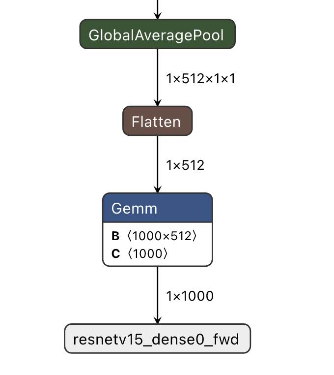

======================
Quick Start
======================

本章节将依次介绍:

* 如何在不同系统环境下安装 ``Docker``
* 如何启动 ``Docker`` 容器
* 如何利用 ``SuperPulsar Docker`` 工具链将 ``onnx`` 模型转换为 ``joint`` 模型
* 如何使用 ``joint`` 模型在 ``x86`` 平台上仿真运行
* 如何衡量 ``joint`` 的推理结果与 ``onnx`` 推理结果之间的差异度(内部称之为 ``对分``)

本章节提到的模型的板上运行速度是基于工具链 ``axera_neuwizard_v0.6.1.4.tar.gz`` 编译生成的, 并不作为实际性能评估的依据.

.. note::

    所谓 ``对分``, 即对比工具链编译前后的同一个模型不同版本 (文件类型) 推理结果之间的误差.

.. _dev_env_prepare:

----------------------
开发环境准备
----------------------

本节介绍使用 ``SuperPulsar`` 工具链前的开发环境准备工作.

``SuperPulsar`` 使用 ``Docker`` 容器进行工具链集成, 用户可以通过 ``Docker`` 加载 ``SuperPulsar`` 镜像文件, 然后进行模型转换、编译、仿真等工作, 因此开发环境准备阶段只需要正确安装 ``Docker`` 环境即可. 支持的系统 ``MacOS``, ``Linux``, ``Windows``.

~~~~~~~~~~~~~~~~~~~~~~~~~~~~~~~
安装 Docker 开发环境
~~~~~~~~~~~~~~~~~~~~~~~~~~~~~~~

- `MacOS 安装 Docker 环境 <https://docs.docker.com/desktop/mac/install/>`_

- `Linux 安装 Docker 环境 <https://docs.docker.com/engine/install/##server>`_

- `Windows 安装 Docker 环境 <https://docs.docker.com/desktop/windows/install/>`_

``Docker`` 安装成功后, 输入 ``sudo docker -v``

.. code-block:: shell

    $ sudo docker -v
    Docker version 20.10.7, build f0df350

显示以上内容, 说明 ``Docker`` 已经安装成功. 下面将介绍 ``SuperPulsar`` 工具链 ``Image`` 的安装和启动.

~~~~~~~~~~~~~~~~~~~~~~~~~~~~~~~
安装 SuperPulsar 工具链
~~~~~~~~~~~~~~~~~~~~~~~~~~~~~~~

以系统版本为 ``Ubuntu 18.04``、工具链 ``axera_neuwizard_v0.6.1.4.tar.gz`` 为例说明 ``SuperPulsar`` 工具链的安装方法.

^^^^^^^^^^^^^^^^^^^^^^^
载入 Docker Image
^^^^^^^^^^^^^^^^^^^^^^^

解压 ``axera_neuwizard_v0.6.1.4.tar.gz`` 后进入 ``axera_neuwizard_v0.6.1.4`` 目录, 运行 ``install.sh`` 脚本, 加载工具链镜像文件. 代码示例如下:

.. code-block:: shell

    $ tar -xvf axera_neuwizard_v0.6.1.4.tar.gz  # 工具链由内部工作人员发送给用户
    $ cd axera_neuwizard_v0.6.1.4
    $ ls .
    axera_neuwizard_0.6.1.4.tgz  install.sh  VERSION
    $ sudo ./install.sh

其中 ``install.sh`` 为可执行脚本, 用于加载 ``.tgz`` 镜像文件. 正确导入镜像文件会打印以下日志:

.. code-block:: shell

    $ sudo ./install.sh
    0e4056611adc: Loading layer [==================================================]  243.7MB/243.7MB
    e4ff4d6a40b8: Loading layer [==================================================]   2.56kB/2.56kB
    a162c244071d: Loading layer [==================================================]  3.072kB/3.072kB
    564c200efe9b: Loading layer [==================================================]  4.608kB/4.608kB
    b945acdca3b6: Loading layer [==================================================]  6.144kB/6.144kB
    ee6ebe7bedc1: Loading layer [==================================================]   5.12kB/5.12kB
    45f02a0e56e2: Loading layer [==================================================]  2.048kB/2.048kB
    9758fe1f19bd: Loading layer [==================================================]   2.56kB/2.56kB
    Loaded image: axera/neuwizard:0.6.1.4

完成后, 执行 ``sudo docker image ls``

.. code-block:: shell

    $ sudo docker image ls
    # 打印以下数据
    REPOSITORY                               TAG           IMAGE ID       CREATED         SIZE
    axera/neuwizard                          0.6.1.4       2124c702c879   3 weeks ago     3.24GB

可以看到工具链镜像已经成功载入, 之后便可以基于此镜像启动容器.

^^^^^^^^^^^^^^^^^^^^^^^
启动工具链镜像
^^^^^^^^^^^^^^^^^^^^^^^

.. attention::

    ``SuperPulsar`` 工具链基于 ``Docker`` 容器构建, 运行时对物理机内存要求较高, 通常推荐物理机内存至少为 ``32G`` 及以上, 
    在模型转换期间如果内存不足, 可能会出现 ``neuwizard killed by SIGKILL`` 错误.

执行以下命令启动 ``Docker`` 容器, 运行成功后进入 ``bash`` 环境

.. code-block:: shell

    $ sudo docker run -it --net host --rm --shm-size 32g -v $PWD:/data axera/neuwizard:0.6.1.4

其中 ``--shm-size`` 参数推荐设置为 ``32g`` 及以上,  ``-v`` 参数控制外部文件夹与容器内部文件夹的映射, 例如 ``$PWD:/data`` 表示将当前文件夹映射至容器中的 ``/data`` 文件夹下. 

.. _model_compile_and_sim:

-------------------------
模型编译仿真以及对分说明
-------------------------

本章节介绍 ``ONNX`` 模型转换的基本操作, 使用 ``pulsar`` 工具将 ``ONNX``  模型编译成 ``Joint`` 模型. 请先参考 :ref:`开发环境准备 <dev_env_prepare>` 章节完成开发环境搭建. 
本节示例模型为开源模型 ``ResNet18``.

~~~~~~~~~~~~~~~~~~~~~~~~~~~~~~~
数据准备
~~~~~~~~~~~~~~~~~~~~~~~~~~~~~~~

.. hint::

    本章节所需模型 ``ResNet18`` 及相关依赖已在 ``quick_start_example`` 文件夹中提供 百度网盘地址待补充 然后将下载的文件解压后拷贝到 ``docker`` 的 ``/data`` 路径下.

成功启动工具链镜像后, 将 ``quick_start_example.zip`` 解压后得到的五个文件夹复制到 ``/data`` 文件夹中, 然后执行

.. code-block:: shell

    root@xxx:/data# ls
    config  dataset  gt  images  model

其中 ``model`` 文件夹中用于存放待编译的 ``ONNX`` 模型文件, ``dataset`` 用于存放 ``PTQ`` (Post-Training Quantization) 所需的 ``Calibration`` 数据集 (数据集以 ``.tar`` 格式打包), 
``config`` 文件夹用于存放模型编译所需的配置文件, ``gt`` 用于存放仿真运行的结果数据, ``images`` 用于存放测试图像.

数据准备工作完毕后, 目录树结构如下:

.. code-block:: shell

    root@xxx:/data# tree
    .
    ├── config
    │   └── config_resnet18.prototxt
    ├── dataset
    │   └── imagenet-1k-images.tar
    ├── gt
    ├── images
    │   ├── cat.jpg
    │   ├── img-319.jpg
    │   ├── img-416.jpg
    │   └── img-642.jpg
    └── model
        └── resnet18.onnx

.. hint::

    工具链 ``docker`` 中没有预装 ``tree`` 命令, 可以在 ``docker`` 外部查看.

~~~~~~~~~~~~~~~~~~~~~~~~~~~~~~~
命令说明
~~~~~~~~~~~~~~~~~~~~~~~~~~~~~~~

``SuperPulsar`` 工具链中的功能指令以 ``pulsar`` 开头, 与用户强相关的命令为 ``pulsar build`` , ``pulsar run`` 以及 ``pulsar version``. 

* ``pulsar build`` 用于将 ``onnx`` 模型转换为 ``joint`` 格式模型
* ``pulsar run`` 用于模型转换前后的 ``对分`` 验证
* ``pulsar version`` 可以用于查看当前工具链的版本信息, 通常在反馈问题时需要提供此信息

.. code-block:: shell

    root@xxx:/data# pulsar --help
    usage: pulsar [-h] {debug,build,version,info,run,view} ...

    positional arguments:
    {debug,build,version,info,run,view}
        debug               score compare debug tool
        build               from onnx to joint
        version             version info
        info                brief model
        run                 simulate models
        view                neuglass to visualize mermaids

    optional arguments:
    -h, --help            show this help message and exit

~~~~~~~~~~~~~~~~~~~~~~~~~~~~~~~
配置文件说明
~~~~~~~~~~~~~~~~~~~~~~~~~~~~~~~

``/data/config/`` 路径下的 ``config_resnet18.prototxt`` 展示:

.. code-block:: shell

    # 基本配置参数：输入输出
    input_type: INPUT_TYPE_ONNX
    output_type: OUTPUT_TYPE_JOINT

    # 硬件平台选择
    target_hardware: TARGET_HARDWARE_AX620

    # CPU 后端选择，默认采用 AXE
    cpu_backend_settings {
        onnx_setting {
            mode: DISABLED
        }
        axe_setting {
            mode: ENABLED
            axe_param {
                optimize_slim_model: true
            }
        }
    }

    # 模型输入数据类型设置
    src_input_tensors {
        color_space: TENSOR_COLOR_SPACE_RGB
    }

    dst_input_tensors {
        color_space: TENSOR_COLOR_SPACE_RGB
        # color_space: TENSOR_COLOR_SPACE_NV12	# 若输入数据是 NV12, 则使用该配置
    }

    # neuwizard 工具的配置参数
    neuwizard_conf {
        operator_conf {
            input_conf_items {
                attributes {
                    input_modifications {
                        affine_preprocess {
                            slope: 1
                            slope_divisor: 255
                            bias: 0
                        }
                    }
                    input_modifications {
                        input_normalization {
                            mean: [0.485,0.456,0.406]  ## 均值
                            std: [0.229,0.224,0.255]   ## 方差
                        }
                    }
                }
            }
        }
        dataset_conf_calibration {
            path: "../dataset/imagenet-1k-images.tar" # 设置 PTQ 校准数据集路径
            type: DATASET_TYPE_TAR         # 数据集类型：tar 包
            size: 256                      # 量化校准过程中实际使用的图片张数
            batch_size: 1
        } 
    }

    # 输出 layout 设置, 建议使用 NHWC, 速度更快
    dst_output_tensors {
        tensor_layout:NHWC
    }

    # pulsar compiler 的配置参数
    pulsar_conf {
        ax620_virtual_npu: AX620_VIRTUAL_NPU_MODE_111	# 业务场景需要使用 ISP, 则必须使用 vNPU 111 配置, 1.8Tops 算力给用户的算法模型
        batch_size: 1
        debug : false
    }

~~~~~~~~~~~~~~~~~~~~~~~~~~~~~~~
模型编译
~~~~~~~~~~~~~~~~~~~~~~~~~~~~~~~

以 ``resnet18.onnx`` 为例, 在 ``docker`` 中执行如下 ``pulsar build`` 命令编译生成 ``resnet18.joint``:

.. code-block:: shell

    # 模型转换指令, 可直接复制运行
    pulsar build --input model/resnet18.onnx --output model/resnet18.joint --config config/config_resnet18.prototxt --output_config config/output_config.prototxt

**log 参考信息**

.. code-block:: python

    root@662f34d56557:/data# pulsar build --input model/resnet18.onnx --output model/resnet18.joint --config config/config_resnet18.prototxt --output_config config/output_config.prototxt

    [W Context.cpp:69] Warning: torch.set_deterministic is in beta, and its design and  functionality may change in the future. (function operator())
    [09 06:46:16 frozen super_pulsar.proto.configuration_super_pulsar_manip:229] set task task_0's pulsar_conf.output_dir as /data
    [09 06:46:17 frozen super_pulsar.func_wrappers.wrapper_pulsar_build:28] planning task task_0
    [09 06:46:17 frozen super_pulsar.func_wrappers.wrapper_pulsar_build:334] #################################### Running task task_0 ####################################
    [09 06:46:17 frozen super_pulsar.toolchain_wrappers.wrapper_neuwizard:31] python3 /root/python_modules/super_pulsar/super_pulsar/toolchain_wrappers/wrapper_neuwizard.py --config /tmp/tmpa18v1l0m.prototxt
    [09 06:53:25 frozen super_pulsar.toolchain_wrappers.wrapper_neuwizard:37] DBG [neuwizard] ONNX Model Version 7 for "/data/model/resnet18.onnx"
    ... ...
    [09 07:10:33 frozen super_pulsar.toolchain_wrappers.wrapper_toolchain:482] File saved: /data/model/resnet18.joint
    [09 07:10:33 frozen super_pulsar.toolchain_wrappers.wrapper_toolchain:489] DBG cleared /root/tmpxd2caw3b

.. attention::

    ``resnet18.onnx`` 模型在硬件配置为:

        - Intel(R) Xeon(R) Gold 6130 CPU @ 2.10GHz
        - Memory 32G

    的服务器上的转换时间大概是 ``3min`` 左右, 不同配置机器可能转换时间不同, 需要耐心等待.

~~~~~~~~~~~~~~~~~~~~~~~~~~~~~~~
上板测速
~~~~~~~~~~~~~~~~~~~~~~~~~~~~~~~

在 ``pulsar build`` 阶段生成的 ``resnet18.joint`` 模型可以在 **AX开发板** 上通过 ``run_joint`` 指令进行模型测速, 步骤如下:

- 首先通过 ``ssh`` 或 ``串口通信`` 的方式连接 **AX开发板**

- 然后将 ``resnet18.joint`` 模型拷贝或挂载到开发板的任意文件夹下

- 最后执行指令 ``run_joint resnet18.joint --repeat 100 --warmup 10``

**Resnet18 测速日志示例**

.. code-block:: bash

    $ run_joint resnet18.joint --repeat 100 --warmup 10
    run joint version: 0.5.10

    virtual npu mode is 1_1

    tools version: 0.6.1.4
    59588c54
    Using wbt 0
    Max Batch Size 1
    Support Dynamic Batch? No
    Is FilterMode? No

    Quantization Type is 8 bit

    Input[0]: data
        Shape [1, 224, 224, 3] NHWC uint8 RGB
        Memory Physical
        Size 150528
    Output[0]: resnetv15_dense0_fwd
        Shape [1, 1000] NHWC float32
        Memory Physical
        Size 4000

    Using batch size 1
    input[0] data data not provided, using random data

    Not set environment variable to report memory usage!

    CMM usage: 13761984

    Create handle took 577.64 ms (neu 9.81 ms, onnx 0.00 ms, axe 0.00 ms, overhead 567.83 ms)
    Run task took 6986 us (99 rounds for average)
            Run NEU took an average of 6948 us (overhead 10 us)

    NPU perf cnt total: 5444156
            NPU perf cnt of eu(0): 2541468
            NPU perf cnt of eu(1): 0
            NPU perf cnt of eu(2): 0
            NPU perf cnt of eu(3): 4068580
            NPU perf cnt of eu(4): 0

.. hint::

    在上述日志中, ``resnet18`` 的 ``NPU`` 推理耗时为 ``6.986ms`` (``NEU`` 文件在 ``NPU`` 上执行), 无 ``CPU`` 耗时, ``overhead`` 为模型解压、解析、加载以及内存分配所用的时间, 只初始化一次, 在实际应用中可以忽略.

在某些情况下, 转换后的模型会包含 ``CPU 尾巴`` (指运行在 ``CPU`` 上的 ``DAG`` 子图, 子图模型以 ``.onnx`` 或 ``.axe`` 结尾), 包含 ``CPU`` 尾巴的模型测速日志示例如下:

.. code-block:: bash

    $ run_joint resnet50.joint --repeat 100 --warmup 10
    run joint version: 0.5.13

    virtual npu mode is 1_1
    tools version: 0.5.34.2
    7ca3b9d5
    Using wbt 0
    Max Batch Size 1
    Support Dynamic Batch? No
    Is FilterMode? No

    Quantization Type is unknown

    Input[0]: data
        Shape [1, 224, 224, 3] NHWC uint8 BGR
        Memory Physical
        Size 150528
    Output[0]: resnetv24_dense0_fwd
        Shape [1, 1000] NCHW float32
        Memory Virtual
        Size 4000

    Using batch size 1
    input[0] data data not provided, using random data

    Create handle took 1830.94 ms (neu 44.76 ms, onnx 0.00 ms, axe 13.89 ms, overhead 1772.28 ms)
    Run task took 32744 us (99 rounds for average)
        Run NEU took an average of 32626 us (overhead 22 us)
        Run AXE took an average of 43 us (overhead 4 us)

从上述示例可以看出, ``NPU`` 推理耗时 ``32.626ms``, ``CPU`` 耗时 ``43us``, 模型推理的总耗时为 ``NPU`` 耗时与 ``CPU`` 耗时之和, 为 ``32.744ms``.

**run_joint 指令说明**

.. code-block:: bash

    $ run_joint -h
    undefined short option: -h
    usage: run_joint [options] ... joint-file
    options:
        --mode                   NPU mode, disable for no virtual npu; 1_1 for AX_NPU_VIRTUAL_1_1 (string [=])
    -d, --data                   The format is file0;file1... to specify data files for input vars.
        'file*' would be directly loaded in binary format to tensor in order (string [=])
        --bin-out-dir            Dump output tensors in binary format (string [=])
        --repeat                 Repeat times for inference (int [=1])
        --warmup                 Repeat times for warmup (int [=0])
        --stride_w               mock input data with extra width stride (int [=0])
        --override_batch_size    override batch size for dynamic batch model (int [=0])
        --wbt_index              select WBT for inference (int [=0])
    -p, --manual_alloc           manually alloc buffer with ax sys api instead of joint api
    -t, --enable_trunc           truncate input data size to model required size when using a larger input data, experimental function, will be removed in future release
        --cache-mode             'CACHED' means use only cached CMM memory; 'NONE-CACHED' means use only none-cached CMM memory; 'SMART_CACHED' means use cached and none-cached CMM memory in turn (string [=CACHED])
    -?, --help                   print this message

.. _pulsar_run_sim:

~~~~~~~~~~~~~~~~~~~~~~~~~~~~~~~
x86仿真运行与对分说明
~~~~~~~~~~~~~~~~~~~~~~~~~~~~~~~

.. attention::

    注意, 本节所有内容基于工具链 ``axera_neuwizard_v0.6.1.4``, 在不同版本中, 
    指令参数可能会不同, 使用 ``pulsar run -h`` 指令可以方便观察指令输入参数列表. 其他命令也可以采用相同方法查看参数列表.

在 ``docker`` 中执行 ``pulsar run`` 命令可以获得 ``onnx`` 和 ``joint`` 模型的推理结果以及模型输出结果之间的差异程度:

.. code-block:: shell

    # 模型仿真与对分指令, 可直接复制运行
    pulsar run model/resnet18.onnx model/resnet18.joint --input images/img-319.jpg --config config/output_config.prototxt --output_gt gt/

**log 信息参考**

.. code-block:: shell

    root@662f34d56557:/data# pulsar run model/resnet18.onnx model/resnet18.joint --input images/img-319.jpg --config config/output_config.prototxt --output_gt gt/

    ...
    ...
    [26 07:14:45 <frozen super_pulsar.func_wrappers.wrapper_pulsar_run>:138] =========================

    [26 07:14:45 <frozen super_pulsar.func_wrappers.pulsar_run.utils>:70] dumpped 'resnetv15_dense0_fwd' to 'gt/joint/resnetv15_dense0_fwd.bin'.
    [26 07:14:45 <frozen super_pulsar.func_wrappers.pulsar_run.compare>:97] ###### Comparing resnet18.onnx (with conf) and resnet18.joint ######
    [26 07:14:45 <frozen super_pulsar.func_wrappers.pulsar_run.compare>:82] Score compare table:
    ---------------------------  ----------------  ------------------
    Layer: resnetv15_dense0_fwd  2-norm RE: 4.70%  cosine-sim: 0.9989

从输出日志中可以获得模型输出的 ``layer_name``, L2正则化以及余弦相似度. 通过余弦相似度(cosine-sim)的结果可直观展示模型精度损失情况(本质上是比较 ``onnx`` 与 ``joint`` 模型推理结果的差异).

^^^^^^^^^^^^^^^^^^^^^^^^^^^^^^^^^^^^
输出文件说明
^^^^^^^^^^^^^^^^^^^^^^^^^^^^^^^^^^^^

执行 ``pulsar build`` 和 ``pulsar run`` 命令后生成的文件说明:

.. code-block:: shell

    root@xxx:/data# tree

    .
    ├── config
    │   ├── config_resnet18.prototxt  # 模型编译配置文件
    │   └── output_config.prototxt    # pulsar run 所需配置文件
    ├── dataset
    │   └── imagenet-1k-images.tar    # 校准数据集
    ├── gt                            # 可用于板上运行 demo 的输入数据
    │   ├── input
    │   │   ├── data.bin
    │   │   ├── data.npy
    │   │   └── filename.txt
    │   ├── joint                     # joint 模型仿真运行的输出数据
    │   │   ├── resnetv15_dense0_fwd.bin
    │   │   └── resnetv15_dense0_fwd.npy
    │   └── onnx                      # onnx 模型仿真运行的输出数据
    │       ├── resnetv15_dense0_fwd.bin
    │       └── resnetv15_dense0_fwd.npy
    ├── images                        # 测试图片
    │   ├── cat.jpg
    │   ├── img-319.jpg
    │   ├── img-416.jpg
    │   └── img-642.jpg
    ├── inference_report
    │   └── part_0.lava
    │       ├── inference_report.log
    │       ├── subgraph_0
    │       │   └── inference_report.log
    │       └── subgraph_1
    │           └── inference_report.log
    └── model
        ├── model.lava_joint
        ├── resnet18.joint            # 编译生成的 Joint 模型
        └── resnet18.onnx             # 原始的 ONNX 模型

    12 directories, 20 files

.. hint::

    ``pulsar run`` 输出的 ``gt`` 文件夹中保存了 ``onnx`` 和 ``joint`` 模型的仿真推理结果, 可以用于手动对分(``x86`` 平台下 ``joint`` 仿真结果与板上输出结果之间的对分)和解析 ``joint`` 模型的输出结果.

^^^^^^^^^^^^^^^^^^^^^^^^^^^^^^^^^^^^
解析 ``joint`` 模型的推理结果
^^^^^^^^^^^^^^^^^^^^^^^^^^^^^^^^^^^^

``gt`` 文件树如下:

.. code-block:: bash

    $ tree gt
    gt
    ├── input  # onnx 和 joint 模型的输入数据
    │   ├── data.bin
    │   ├── data.npy
    │   └── filename.txt
    ├── joint  # joint 模型的推理结果
    │   ├── resnetv15_dense0_fwd.bin
    │   └── resnetv15_dense0_fwd.npy
    └── onnx  # onnx 模型的推理结果
        ├── resnetv15_dense0_fwd.bin
        └── resnetv15_dense0_fwd.npy

    3 directories, 7 files

* 在 ``input`` 文件夹中给出了模型的输入数据, 共两种形式: ``.bin`` 和 ``.npy``, 包含相同的数据信息.
* 在 ``onnx`` 和 ``joint`` 文件夹下分别给出了模型的推理结果, 可以根据需要对模型的输出结果进行处理, 以满足不同的需求.

下面以 ``resnet18`` 为例, 说明如何对模型的推理结果进行处理, ``resnet18`` 模型的输出结构如下:

输出 shape 为 (1, 1000) 的分类结果, 示例代码 (``parse_gt.py``) 如下:

.. code-block:: bash

    #!/usr/bin/env python3
    import math
    import numpy as np
    import json
    import logging

    # 注意: 示例代码基于 resnet18 模型, 其他模型可以根据实际情况修改
    if __name__ == '__main__':
        import argparse
        parser = argparse.ArgumentParser()
        parser.add_argument(dest='npy', nargs="+", help='pulsar run, gt, npy file')
        parser.add_argument('--K', type=int, default=5, help='top k')
        parser.add_argument('--rtol', type=float, default=1e-2, help='relative tolerance')
        parser.add_argument('--atol', type=float, default=1e-2, help='absolute tolerance')
        args = parser.parse_args()

        assert len(args.npy) <= 2
        with open('./imagenet1000_clsidx_to_labels.json', 'r') as f:
            # imagenet1000_clsidx_to_labels: https://gist.github.com/yrevar/942d3a0ac09ec9e5eb3a
            js = f.read()
            imgnet1000_clsidx_dict = json.loads(js)
        
        for npy in args.npy:
            result = np.load(npy)
            indices = (-result[0]).argsort()[:args.K]
            logging.warning(f"{npy}, imagenet 1000 class index, top{args.K} result is {indices}")
            
            for idx in indices:
                logging.warning(f"idx: {idx}, classification result: {imgnet1000_clsidx_dict[str(idx)]}")
        
        if len(args.npy) == 2:  # 对两个 npy 进行对分, 无输出, 则表示对分成功
            npy1 = np.load(args.npy[0])
            npy2 = np.load(args.npy[1])
            assert not math.isnan(npy1.sum()) and not math.isnan(npy2.sum())
            try:
                if npy1.dtype == np.float32:
                    assert np.allclose(npy1, npy2, rtol=args.rtol, atol=args.atol), "mismatch {}".format(abs(npy1 - npy2).max())
                else:
                    assert np.all(npy1 == npy2), "mismatch {}".format(abs(npy1 - npy2).max())
            except AssertionError:
                logging.warning("abs(npy1 - npy2).max() = ", abs(npy1 - npy2).max())

通过执行以下指令

.. code-block:: bash

     python3 parse_gt.py  gt/onnx/resnetv15_dense0_fwd.npy gt/joint/resnetv15_dense0_fwd.npy --atol 100000 --rtol 0.000001

输出结果示例:

.. code-block:: python

    WARNING:root:gt/onnx/resnetv15_dense0_fwd.npy, imagenet 1000 class index, top5 result is [924 948 964 935 910]
    WARNING:root:idx: 924, classification result: guacamole
    WARNING:root:idx: 948, classification result: Granny Smith
    WARNING:root:idx: 964, classification result: potpie
    WARNING:root:idx: 935, classification result: mashed potato
    WARNING:root:idx: 910, classification result: wooden spoon
    
    WARNING:root:gt/joint/resnetv15_dense0_fwd.npy, imagenet 1000 class index, top5 result is [924 948 935 964 910]
    WARNING:root:idx: 924, classification result: guacamole
    WARNING:root:idx: 948, classification result: Granny Smith
    WARNING:root:idx: 935, classification result: mashed potato
    WARNING:root:idx: 964, classification result: potpie
    WARNING:root:idx: 910, classification result: wooden spoon

.. hint::

    ``parse_gt.py`` 中支持对两个 ``npy`` 进行对分, 执行后若没有相关对分日志输出, 则表示对分成功.

.. _pulsar_run_gt_compare:

^^^^^^^^^^^^^^^^^^^^^^^^^^^^^^^^^^^^
``gt`` 文件对分具体操作说明
^^^^^^^^^^^^^^^^^^^^^^^^^^^^^^^^^^^^

.. hint::

    手动对分在一般情况下是非必要的, 通过 ``pulsar run`` 观察 ``cosine-sim`` 可以很方便地观察模型精度损失情况.

手动对分需要手动构建对分脚本, 具体参考如下:

.. code-block:: bash

  # 创建对分使用的脚本文件

  $ vim compare_fp32.py

``compare_fp32.py`` 内容如下:

.. code-block:: python

  #!/usr/bin/env python3
  import math
  import numpy as np

  if __name__ == '__main__':
      import argparse
      parser = argparse.ArgumentParser()
      parser.add_argument(dest='bin1', help='bin file as fp32')
      parser.add_argument(dest='bin2', help='bin file as fp32')
      parser.add_argument('--rtol', type=float, default=1e-2,
                          help='relative tolerance')
      parser.add_argument('--atol', type=float, default=1e-2,
                          help='absolute tolerance')
      parser.add_argument('--report', action='store_true', help='report for CI')
      args = parser.parse_args()

      try:
          a = np.fromfile(args.bin1, dtype=np.float32)
          b = np.fromfile(args.bin2, dtype=np.float32)
          assert not math.isnan(a.sum()) and not math.isnan(b.sum())
      except:
          a = np.fromfile(args.bin1, dtype=np.uint8)
          b = np.fromfile(args.bin2, dtype=np.uint8)
      try:
          if a.dtype == np.float32:
              assert np.allclose(a, b, rtol=args.rtol, atol=args.atol), "mismatch {}".format(abs(a - b).max())
          else:
              assert np.all(a == b), "mismatch {}".format(abs(a - b).max())
          if args.report:
              print(0)
      except AssertionError:
          if not args.report:
              raise
          else:
              print(abs(a - b).max())

脚本创建成功后, 执行如下命令, 得到 ``joint`` 模型实际上板结果:

.. code-block:: bash

  run_joint resnet18.joint --data gt/input/data.bin  --bin-out-dir out/ --repeat 100

``joint`` 上板结果保存在 ``out`` 文件夹中.

.. code-block:: bash

  $ python3 compare_fp32.py --atol 100000 --rtol 0.000001 gt/joint/resnetv24_dense0_fwd.bin out/resnetv24_dense0_fwd.bin

命令执行后, 无任何返回结果即为对分成功.

.. _onboard_running:

----------------------
开发板运行
----------------------

本章节介绍如何在 ``AX620A`` 开发板上运行通过 :ref:`模型编译仿真 <model_compile_and_sim>` 章节获取 ``resnet18.joint`` 模型. 
示例中给出了一个分类网络如何对输入图像进行分类, 而更具体的内容, 例如如何交叉编译生成可执行程序 ``ax_classification`` 
或如何在 ``ARM`` 板上运行 **检测模型**, 请参考 :ref:`模型部署详细说明 <model_deploy_advanced>` 章节.

~~~~~~~~~~~~~~~~~~~~~~~~~~~~~~~
板上运行的数据准备
~~~~~~~~~~~~~~~~~~~~~~~~~~~~~~~

.. hint::

    上板运行示例已经打包放在 ``demo_onboard`` 文件夹下 百度网盘地址待补充
    将下载后的文件解压, 其中 ``ax_classification`` 为预先交叉编译好的可在 ``AX620A`` 开发板上运行的分类模型可执行程序. 
    ``resnet18.joint`` 为编译好的分类模型, ``cat.png`` 为测试图像.

将 ``ax_classification``、 ``resnet18.joint``、 ``cat.png`` 拷贝到开发板上, 如果 ``ax_classification`` 缺少可执行权限, 可以通过以下命令添加

.. code-block:: shell

    /root/sample # chmod a+x ax_classification  # 添加执行权限
    /root/sample # ls -l
    total 15344
    -rwxrwxr-x    1 1000     1000       3806352 Jul 26 15:22 ax_classification
    -rw-rw-r--    1 1000     1000        140391 Jul 26 15:22 cat.jpg
    -rw-rw-r--    1 1000     1000      11755885 Jul 26 15:22 resnet18.joint

~~~~~~~~~~~~~~~~~~~~~~~~~~~~~~~~~~~~
在板上运行 ``Resnet18`` 分类模型
~~~~~~~~~~~~~~~~~~~~~~~~~~~~~~~~~~~~

``ax_classification`` 输入参数说明: 

.. code-block:: shell

    /root/sample # ./ax_classification --help
    usage: ./ax_classification --model=string --image=string [options] ...
    options:
    -m, --model     joint file(a.k.a. joint model) (string)
    -i, --image     image file (string)
    -g, --size      input_h, input_w (string [=224,224])
    -r, --repeat    repeat count (int [=1])
    -?, --help      print this message

通过执行 ``ax_classification`` 程序实现分类模型板上运行, 运行结果如下:

.. code-block:: shell

    /root/yq/sample # ./ax_classification -m resnet18.joint -i cat.png -r 100
    --------------------------------------
    model file : resnet18.joint
    image file : cat.jpg
    img_h, img_w : 224 224
    Run-Joint Runtime version: 0.5.10
    --------------------------------------
    [INFO]: Virtual npu mode is 1_1

    Tools version: 0.6.1.4
    59588c54
    11.4611, 285
    10.0656, 278
    9.8469, 287
    9.0733, 282
    9.0031, 279
    --------------------------------------
    Create handle took 579.73 ms (neu 10.05 ms, axe 0.00 ms, overhead 569.68 ms)
    --------------------------------------
    Repeat 100 times, avg time 7.00 ms, max_time 7.83 ms, min_time 6.97 ms
